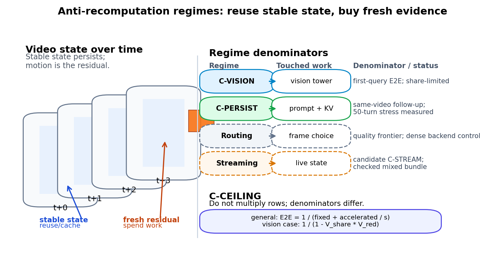

# VLMaxxing through FrameMogging

[](https://github.com/jfbastien/VLMaxxing/actions/workflows/ci.yml)
[](https://vlmaxxi.ng)


**Training-Free Anti-Recomputation for Video Vision-Language Models**

Research code, artifacts, and manuscript tooling for training-free
anti-recomputation in video vision-language models.

The repo is organized around a small set of claim-bearing regimes:

- **C-CEILING**: component speedups survive to end-to-end latency only in
  proportion to the dense wall-clock share they own.
- **C-PERSIST**: after ingest, same-video follow-up queries can be much cheaper
  inside a tested cache-reuse envelope.
- **C-VISION**: bounded measured sparse-vision execution exists; broad sparse
  backends and sparse LM prefill remain open.
- **candidate C-STREAM**: native-rate streaming state reuse has a checked
  mixed/boundary bundle, but it is not an earned headline until a native policy
  beats matched baselines under cache-correctness and stale-cache tests.

The durable imported-target summary is in [docs/claim-register.md](docs/claim-register.md),
local reproduction status is in [docs/reproduction-status.md](docs/reproduction-status.md),
and raw history remains in git.



## Quick Start

```bash
uv sync --locked --group dev --group research
uv run ruff format --check .
uv run ruff check .
uv run mypy src tests
uv run pytest
uv run python scripts/audit_artifact_integrity.py
```

For local MLX / MLX-VLM research utilities:

```bash
uv sync --locked --group dev --group research --group vlm
```

For local corpus assets:

```bash
uv run python scripts/fetch_corpus.py --tier primary --encode
uv run python scripts/generate_synthetic_corpus.py
```

For benchmark-native TOMATO / MVBench / VideoMME assets, start with
[docs/benchmark-setup.md](docs/benchmark-setup.md). VideoMME uses checked
manifest subsets and a separate subset fetch path documented in
[docs/videomme-download-handoff.md](docs/videomme-download-handoff.md).

For the paper:

```bash
uv sync --locked --group dev --group research --group benchmark --group paper
brew install tectonic  # macOS; any XeLaTeX/Tectonic install also works
make paper-doctor
make paper-sync
make paper-build
```

## Where To Read First

For readers and reviewers:

- [paper/arxiv/README.md](paper/arxiv/README.md): manuscript build and generated assets
- [paper/claim-matrix.md](paper/claim-matrix.md): paper-facing claim truth table
- [paper/publishability-status.md](paper/publishability-status.md): current reviewer-facing claim inventory
- [docs/reproduction-status.md](docs/reproduction-status.md): local reproduction status
- [research/experiments/registry.md](research/experiments/registry.md): phase/artifact ledger

For contributors and agents:

- [AGENTS.md](AGENTS.md): canonical coding-agent guidance
- [PLAN.md](PLAN.md): current roadmap and open gates
- [docs/README.md](docs/README.md): durable docs router
- [research/README.md](research/README.md): experiment-note workflow
- [docs/methodology/performance.md](docs/methodology/performance.md): timing and denominator rules

## Repository Layout

```text
.
├── docs/        stable methodology, setup, literature, and status
├── paper/       arXiv manuscript, generated assets, and paper claim ledgers
├── research/    dated experiment notes, registry, and checked artifacts
├── scripts/     reusable runners, analyzers, validators, and plotters
├── src/         importable codec_through package
└── tests/       unit tests for reusable code
```

Checked research artifacts remain in this repo when they directly support
tables, figures, or status claims. Large future bundles should use a manifest
with checksums, but deleting current artifact evidence would make the paper
harder to audit.

## Research Principles

- label claims as reproduced here, imported target, or hypothesis
- separate semantic answer stability from real skipped work
- report denominators and setup costs explicitly
- keep negative results when they change the claim boundary
- use primary sources for literature and standards claims

## Citation

Once the arXiv record is public, cite the paper linked at the top of this
README. [CITATION.cff](CITATION.cff) is kept so GitHub can expose citation
metadata; add the paper as its preferred citation before tagging the release.

## License

- code: [MIT](LICENSE)
- docs, research notes, and paper materials: [CC BY 4.0](LICENSE-docs)
