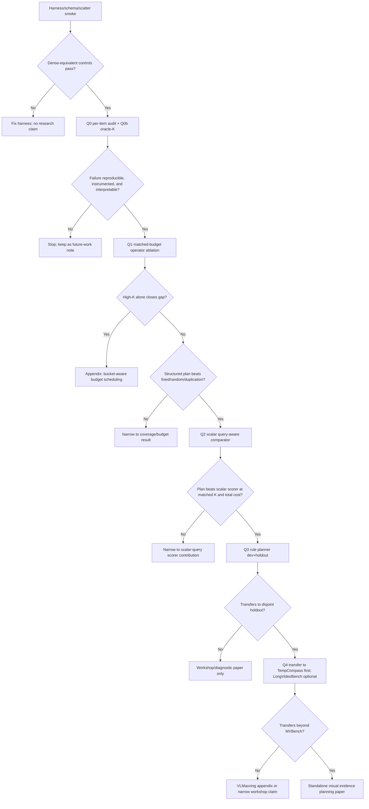

# Query-Aware Visual Routing: Research Seed

Status: self-standing handoff note for a future paper/branch. Do not implement
on the current RLT/VLMaxxing closure branch.

Audience: an expert scientist who has not read this repo. The goal is to give
enough context to run an extensive literature and experiment-design pass, then
bring back a concrete query-aware visual-routing proposal.

Evidence labels:

- `reproduced here`: measured in this repo with checked scripts/artifacts.
- `imported result`: from cited literature, not reproduced in this repo.
- `hypothesis`: proposed next work.

2026-05-14 implementation prereg: the first executable branch is implemented
as Q0b/Q1 infrastructure, not as planner/repair work. See
`research/experiments/2026/2026-05-14-query-routing-q0b-q1-prereg.md`.
The queue now has `--run-query-routing-q0b`, `--run-query-routing-q1`, and
`--query-routing-benchmarks`; the analyzer accepts dense-equivalent,
admission-only, C-VISION-only, and full-composition direct-pair arms; and Q1
has deterministic `rlt_topk_static_floor`, `fixed_uniform`, and
`random_valid` C-VISION modes. These cells can earn only a proceed-to-Q2
verdict until scalar-query baselines are run.

2026-05-15 Q0b/Q1 result: the first executable branch killed the initial
typed-operator hypothesis. Dense-equivalence and C-VISION-only oracle checks
passed, but static-floor and redundancy-top-k did not beat fixed/random
coverage controls on the MVBench target pool. This narrows the future paper:
do not build a full query planner unless a cheaper Q1b diagnostic finds
headroom in endpoint anchors, admission scheduling, or a tiny class-conditional
dense fallback. If Q1b is also negative, the query-aware story should stay as
a VLMaxxing appendix and future work should move to scalar query allocation
(QuoTA-style), trained frame selection (Frame-Voyager style), or active
evidence seeking rather than hand-built typed C-VISION operators.

2026-05-10 deep-research update: ChatGPT's external literature assessment
largely validates the direction but narrows the novelty boundary. The surface
form "query-aware video token/frame selection" is crowded. A standalone paper
is justified only if we show **structured visual evidence planning**: a
training-free planner that chooses among heterogeneous physical evidence
operators under measured end-to-end cost, and beats fixed/random coverage plus
strong scalar query-aware scorers. If the win collapses to "use more K" or "use
one scalar query score," this belongs as a VLMaxxing appendix or ablation, not
as a separate paper.

2026-05-10 peer-review update: Active Video Perception and QuoTA are first-class
closest priors, not footnotes. AVP already frames long-video understanding as
iterative active evidence seeking with a planner-observer-reflector loop. QuoTA
already performs training-free query-oriented token assignment via CoT query
decomposition. Our only defensible gap is lower-level, typed physical evidence
operators inside a frozen C-VISION runtime with measured per-operator costs.
The technical framing should lean on anytime/contract algorithms, value of
information, and multi-fidelity cost allocation; database query planning remains
an explanatory analogy for systems readers.

2026-05-10 design-pass update (post deep-research, post peer-review):

- Operators are now precisely defined (`redundancy-topk`, `static-floor`,
  `endpoint-anchor`, `identity-anchor`, `query-budget`, `repair-pass`)
  with composition rules and free parameters; vague "evidence operator"
  language has been retired.
- Q0b oracle-K is specified as a 2x2 of (admission ON/OFF) x (C-VISION
  ON/OFF) plus a kr sweep. Cell (c) "admit OFF / vision ON" is already
  supported by the runner (`--prune-placeholders=none` with
  `--vision-tower-score-mode=rlt_topk`); the missing work is queue
  plumbing plus analyzer-contract expansion.
- H5 cost model is specified as a linear regression with named features,
  training set (Q0b artifacts), held-out validation, and a MAPE >= 25%
  abort condition.
- Q2b QuoTA approximation is specified as Gemma self-scoring via
  binary-choice logprob (Option B), with mlx-vlm logprob-extraction risk
  flagged as a pre-implementation smoke check.
- Q3b AVP handling is tiered: related-work positioning by default
  because there is no matched benchmark/protocol overlap, a
  one-step active-escalation control as the actual local baseline, and
  full reimplementation only under rebuttal pressure.
- Q4 transfer specifies TempCompass first (preregistered ingest exists)
  and de-promises LongVideoBench (no ingest plan, hardware-marginal on
  M3 16GB).
- Q6 statistical preregistration is concrete: paired bootstrap CI is the
  primary inferential object; numeric MDEs are deliberately not quoted
  until an exact paired-binary simulation is written; independent
  benchmark families use Holm-Bonferroni internally, TOST equivalence
  margin Δ_equiv = 0.10, Fisher exact for set-overlap with explicit
  power caveat.
- Cross-validation discipline now requires a fresh `design_v1` slice
  because Round-20 dev has been inspected for the failure taxonomy and
  is therefore burned for rule design.
- Risk register added: per-Q failure modes, Plan B for each, and five
  hard "stop the project" conditions.

2026-05-10 cross-validation pass (third revision, post external review):

- Q0b cell (c) corrected: the runner already supports
  `--prune-placeholders=none` with C-VISION enabled
  (`run_novelty_pruning_gemma.py:614` is independent of placeholder
  pruning). The real gap is queue plumbing
  (`run_rlt_followup_queue.py`) plus an analyzer-contract expansion in
  `analyze_gemma_full_composition.py`. No new runner mode is needed.
- Operator K units corrected: all operators output sets of *encoder
  valid positions* from `gemma_encoder_valid_positions_per_frame`, not
  prompt placeholders (256) and not RLT scoring grid (196). The valid
  encoder count can differ by runner/substrate, so static-floor stride
  and K are derived from the current artifact rather than hard-coded.
- Statistics MDE table replaced: continuous-Wald approximations
  violated the discrete bound |Δacc| ≤ p_d. Numeric MDEs removed; the
  qualitative "n=30 cannot reliably resolve effects below ~0.20" is
  retained, with a note that McNemar exact simulation is the right
  follow-up if a referee insists on a numeric threshold.
- Multiple-comparisons text narrowed: one primary confirmatory family
  carries the standalone-paper claim; other benchmark families are
  transfer/supportive unless explicitly re-preregistered.
- H5 split into H5a (linear cost model, fittable on Q0b/Q1/Q2) and
  H5b (P_repair calibration, gated on Q3c/Q5 landing). H5a is no
  longer blocked on repair data that does not yet exist.
- H5 row-count claim removed: replaced "~540 rows" with "row count
  depends on which Q1 variants land; name held-out benchmark in
  prereg." Plan-level rows are explicitly defined as one row per
  (item, plan) pair.
- Q3b Tier 1 narrowed: AVP cannot be a matched-budget baseline because
  Q4 dropped LongVideoBench, removing protocol overlap. Tier 1 is now
  related-work positioning only; the actual matched-protocol baseline
  is the Tier 2 one-step active escalation (`repair-pass`) on our
  MVBench / TempCompass manifests.

2026-05-12 fourth revision (post ChatGPT deep-review pass 3):

- Substrate-aware V: V=1024 on Track-B/`magnitude_valid` artifacts but
  V=2304 on composition/admission artifacts (verified across
  `cvision_magnitude_valid_*.jsonl` vs `composition_rlt_*.jsonl`).
  Operator K is now defined as `kr * V_per_row` rather than a hard
  number; static-floor stride examples cover both the 32x32 (V=1024)
  and 48x48 (V=2304) grids.
- "Motion-only routing" thesis line corrected to "Redundancy-first
  routing" (case-sensitive grep miss in prior revision).
- Oracle accounting uses existing fields `dense_placeholder_count`,
  `pruned_placeholder_count`, `placeholder_prune_bypassed` (verified
  at `run_novelty_pruning_gemma.py:771-773`); no schema-version bump
  required.
- Output-format normalization added: MVBench's `"Best Option: ("`
  extraction protocol mandated so cost comparisons aren't contaminated
  by answer verbosity. Logprob switch over `{A,B,C,D}` is explicitly
  rejected as a comparability-breaker.
- AVP-mimic relabeled "one-step active escalation" (AVP is strictly
  iterative-until-converged per arXiv 2512.05774; a one-step
  degenerate is not a faithful reimplementation).
- TempCompass scope made honest: it validates temporal-aspect transfer
  only; static-detail and identity-binding claims need separate
  evidence.
- `identity-anchor` first-frame-coverage gate added to Q0: if
  first-frame entity coverage on `object_interaction` < 60%, drop the
  operator before Q1.
- `static-floor` overflow rule added: clip + log when F > K; reject
  the stride if overflow rate exceeds 10% of items.
- `query-budget` operator spec tightened on three gaps:
  largest-remainders sum-preserving rounding, min-one allocation,
  uniform-scores fallback to `redundancy-topk` with null-signal log.
- New "First Implementation Branch" section: code changes, mandatory
  dual-ledger columns (placeholder + encoder), two-table presentation
  mandate (strict per-frame K vs video-level budget), and six smoke
  tests that gate Q1 startup.

## One-Sentence Thesis

For frozen video VLM runtimes, typed visual evidence operators should beat a
single scalar query score when the question demands different physical evidence:
motion, static detail, endpoint state, object relation, or a bounded repair
pass.

## Why This Exists

VLMaxxing is this repo's training-free anti-recomputation project for video
VLMs. The current paper centers on three axes:

- **C-CEILING**: arithmetic ceiling discipline. End-to-end speedup survives
  only in proportion to the dense runtime share a method actually reduces.
- **C-VISION**: first-pass vision-tower compute reduction. The vision tower
  processes only selected visual positions, then scatter-back preserves prompt
  geometry for the language model.
- **C-PERSIST**: after-ingest same-video follow-up reuse. The expensive prefix
  is paid once; later questions reuse state.

The query-aware idea comes from a sharp C-VISION/RLT result. We used RLT's
raw-patch run-length redundancy signal as the C-VISION scorer on Gemma 4 E4B /
MLX-VLM. RLT is cheap: it scores raw frames before the model runs. The
competing max-min diversity scorer is much more expensive because it works over
encoder hidden states.

Local preliminary facts, all reproduced here:

- RLT-as-C-VISION at `keep_rate=0.5` lands positive n=30 E2E cells on
  VideoMME, TOMATO, and MVBench.
- RLT's scorer cost is tens of milliseconds per item; max-min diversity costs
  seconds per item. RLT reaches the same speed class as max-min at roughly two
  orders of magnitude lower scorer cost.
- Direct RLT full composition is high-upside but bucket-conditional. The
  dev+holdout pooled speed frontier is strong, including an MVBench
  direct-composition row at `1.842x` E2E, but quality is not uniformly clean.
- Bucket-specific rescue by raising keep-rate to `0.85` recovers MVBench
  `object_interaction`, but pooled rescue still has bucket failures:
  VideoMME `long`/`medium`, TOMATO `direction`/`rotation`, and MVBench
  `action_localization`/`moving_attribute`.
- `moving_attribute` is the sharpest example, not a universal law. On the dev
  slice, `moving_attribute` stayed at dense accuracy `0.833`, composed accuracy
  `0.333`, and `Delta acc = -0.50` in a `keep_rate=1.0` diagnostic bracket.
  On the disjoint holdout slice, however, `moving_attribute` was clean at the
  base `keep_rate=0.5`, and the later holdout bracket with
  `moving_attribute=1.0` landed dense `0.500`, composed `0.667`, delta
  `+0.167` on n=6. The failure is item/content-class variance, not proof that
  the whole bucket is deterministically unrecoverable.

Important correction from the 2026-05-10 peer review: the dev
`moving_attribute` `keep_rate=1.0` bracket is **not** a clean full-stack
oracle. The queue configured both prompt-admission and C-VISION group overrides
to `1.0`, and the moving-attribute rows report `vision_tower_keep_rate=1.0`;
operationally, that disables C-VISION pruning for those rows. Prompt admission,
however, still uses thresholded RLT masking rather than a fixed-K full-retention
budget, and the same rows still keep only about `0.31-0.34` of RLT prompt
tokens. Treat the bracket as "full C-VISION retention plus thresholded RLT
prompt admission did not rescue the dev failures," not as proof that full
prompt evidence or oracle-K cannot help. A true full-retention/oracle-K probe
must separately prove prompt and C-VISION retention.

That last point is the discovery. Redundancy-first routing is excellent when
redundancy is the evidence-saving opportunity, but the query can ask for
something else: static appearance, endpoint state, object identity, object
relations, or a localized action cue.
Raising K inside the same redundancy-ranked policy sometimes recovers a class
and sometimes does not. The next method should not be "keep more tokens under
the same scorer." It should be "plan the visual evidence from the query."

Round-20 also means some obvious falsification work is partially done. We have
already run disjoint holdout replication and a dev-slice `moving_attribute`
full-C-VISION diagnostic bracket plus a disjoint holdout bracket. Those rows
are boundary probes, not powered bucket claims: the dev slice failed badly,
the holdout slice did not, and pooled rescue remains negative. The next branch
should first audit the harness and run an instrumented oracle-K probe, then
move to matched-budget operator ablations: static-detail floors, endpoint
anchors, fixed coverage, random coverage, duplication-aware coverage, and one
scalar query-aware comparator.

Update after Q1/Q1b measurement on 2026-05-18: the first typed vision-mask
branch did not survive. RLT top-k, static-floor, and endpoint-anchor C-VISION
masks all lost to fixed/random coverage at matched budget. Q1b then showed why
the random/fixed controls looked good: they had prompt admission off. Turning
admission on for the same coverage controls recreated the
`moving_attribute`/`object_interaction` damage. The active hypothesis is now
narrower and more useful: **coverage-first vision masks, plus an admission
scheduler that treats prompt deletion as a separate physical operator.** Q1c
therefore tests only a small admission scheduler before any scalar-query,
repair-pass, or learned-planner work.

Relevant local source files:

- Current paper framing: `paper/framing.md`
- RLT follow-up prereg/results ledger:
  `research/experiments/2026/2026-05-08-rlt-followup-next-prereg.md`
- Decision ledger:
  `research/decision-log.md`
- Follow-up queue:
  `scripts/run_rlt_followup_queue.py`
- Full-composition analyzer:
  `scripts/analyze_gemma_full_composition.py`

## Definitions

### VLMaxxing / C-VISION

`VLMaxxing` is the repo's name for a family of training-free video-VLM
efficiency techniques. The part relevant here is `C-VISION`: reduce vision
tower work by selecting a subset of valid encoder positions per frame, then
scatter-back the skipped positions so the language-model prompt geometry is
unchanged.

The core C-VISION principle:

```text
E2E speedup is bounded by the share of runtime owned by vision compute and by
how much of that vision compute is actually removed.
```

This is not just a token-count story. It is a measured-work story. If decode or
generation dominates, even a large visual reduction yields only a small E2E
gain. If vision dominates, the same visual reduction becomes a large user-facing
speedup.

### RLT

RLT, "Don't Look Twice: Faster Video Transformers with Run-Length
Tokenization" (NeurIPS 2024), identifies repeated same-location patches across
time before model inference. It is cheap because it operates on raw patches,
not encoder hidden states. Imported RLT result: the paper reports faster video
transformer training/inference by removing repeated token runs while preserving
accuracy on action-recognition/video tasks.

Our use of RLT is not a reproduction of RLT's original VideoMAE/action
recognition setup. It is a transfer test: use RLT's raw-patch redundancy signal
as the scorer inside C-VISION and, separately, as a prompt-admission policy for
a video VLM.

### Query-Aware Visual Routing

Query-aware visual routing is a proposed next method family. It treats the
question as a query plan input:

- dynamic-action question: prioritize motion/delta/RLT evidence.
- static-attribute question: preserve keyframe or endpoint appearance detail.
- object-interaction question: preserve object-pair coverage plus motion.
- temporal-order question: preserve begin/middle/end temporal anchors.
- low-confidence or high-risk question: trigger a repair pass with more static
  detail or higher resolution.

The output is a visual evidence plan: frame selection, resolution selection,
token budget, static-detail floor, motion budget, and optional repair policy.

## Operator Definitions

The "operator" abstraction is load-bearing. Vague operator names invite
reviewer skepticism that the planner is just heuristics with extra steps.
Each operator must be definable as a function that takes (query, frames,
budget) and returns a set of valid encoder positions to keep, with a
measured cost. First-paper operators:

**Output-format normalization.** Before any operator timing claim, lock
the answer-extraction protocol so cost comparisons aren't contaminated
by answer verbosity. Use MVBench's benchmark-style prompt suffix
`"Best Option: ("` and parse the next parenthesis-enclosed letter; log
the parse-success rate for every arm. This is a prompt-format and
parser-normalization step, not a log-prob switch, so it preserves
comparability with our existing Round-20 free-form numbers where the
post-hoc parser already accepted the same single-letter answer. Do
**not** switch to true logprob scoring over `{A,B,C,D}` — it
breaks comparability with prior arms (SparseVLM, Static-or-Dynamic,
Frame-Voyager, QuoTA all report MCQ accuracy not logprobs) and adds
implementation risk we don't need. If a per-arm `generation_tokens`
distribution shifts by more than 1 token-equivalent across operators on
a target slice, flag for verbosity audit and consider tightening the
prompt suffix; otherwise no further normalization is required.

For new Q0b/Q1 cells, run a small prompt-cap smoke before the benchmark
cell and use the smallest `max_tokens` cap that preserves parse success
on the smoke slice. Prefer a one-letter/closed-parenthesis stop condition
if the local generation API supports it without changing answer scoring.
If not, keep the benchmark-style suffix and require the token-distribution
audit above. The point is to remove generation-length covariance from
operator comparisons without switching to a different log-prob evaluation
protocol.

**Scale convention.** All operators output sets of *encoder valid
positions* — the unit reported by
`gemma_encoder_valid_positions_per_frame` in the runner JSONL. Do not
hard-code this count: Track-B C-VISION artifacts have observed V=1024
valid encoder positions per frame, while the composition/admission
runner has observed V=2304 valid encoder positions per frame on related
Gemma-4-E4B runs. The Q0b/Q1 runners must read V from the current row
and, for grid operators such as `static-floor`, must also record or
derive the valid encoder grid shape before fixing stride values.
The RLT scorer operates on a 14x14=196 raw-patch grid (`rlt_config.grid_shape`)
and projects onto the encoder grid via `project_bool_grid` to produce the
C-VISION mask. Do not conflate the encoder valid-position grid (observed
V=1024 or V=2304 depending on runner/substrate), the prompt-placeholder
grid (256 per frame after Gemma's resampler), or the RLT scoring grid
(196). Matched-budget comparison is on the encoder valid-position grid,
since that is what `kr` and `kept_groups` measure.

| Operator | Input | Output (per frame) | Free parameters | Cost class |
|---|---|---|---|---|
| `redundancy-topk` | RLT raw-patch run-length scores | top-K encoder positions by projected RLT score, K = `vision_tower_keep_rate * V` where V = `gemma_encoder_valid_positions_per_frame` for that row | `K` | tens of ms / item |
| `static-floor` | uniform sub-grid index set on the encoder grid | a fixed set of F < K encoder positions sampled at a regular sub-grid stride (e.g., stride 4 gives F=64 on a 32x32 valid grid, but F=144 on a 48x48 valid grid) | `F`, sub-grid stride | zero (precomputable, position indices only) |
| `endpoint-anchor` | frame indices | union of *all* encoder positions in the first-frame and last-frame; other frames default to `redundancy-topk` | `anchor frame indices` (default: 0 and N-1) | zero |
| `identity-anchor` | frame indices | all encoder positions of the first frame at full resolution; other frames default to `redundancy-topk` | `anchor frame index` (default: 0) | zero |
| `query-budget` (QuoTA-style) | per-frame relevance score | per-frame budget B^i = round(S_norm^i * total_K), then keep top-B^i encoder positions by `redundancy-topk` within frame | `scoring model`, `total_K` | one extra forward pass per frame for self-scoring (see Q2b cost) |
| `repair-pass` | first-pass answer + uncertainty score | re-run with prompt-admission OFF or with `redundancy-topk` at higher K, only if uncertainty > threshold | `uncertainty threshold` | one extra prefill + decode for triggered items |

**Composition rule.** For operators that act on every frame
(`redundancy-topk`, `static-floor`), the default matched comparison is
per-frame: cap the union at `K = vision_tower_keep_rate * V` for that
frame. Example: if the current row reports V=1024 and `kr=0.5`, then
K=512; if `static-floor` reserves F=64 positions, `redundancy-topk`
receives `K_remaining = 448` positions from the complement. If the row
reports V=2304, the corresponding K is 1152 and the floor size must be
recomputed from the logged valid grid shape. **No double-counting**: if
a position is in the static floor it is not eligible for the
redundancy-topk budget.

Endpoint/identity anchors are different because they deliberately spend
more than K on selected frames. For those operators, use matched
*video-level* budget accounting: total budget is `sum_i K_i` over all
frames; an anchored frame debits V_i from that total; the remaining
budget is allocated across non-anchor frames by `redundancy-topk` from
the complement. Report endpoint/identity results separately from the
strict per-frame-K table so reviewers can see which budget convention is
being used.

**Why the static-floor stride matters.** On a 32x32 encoder grid (V=1024):
stride 2 yields F=256, stride 4 yields F=64, stride 8 yields F=16. On a
48x48 encoder grid (V=2304), the same strides yield F=576, F=144, and
F=36.
Sub-grid stride controls how much of the visual budget is spent on
guaranteed coverage versus redundancy-ranked. Q1 should sweep stride in
{2, 4, 8} as a hyperparameter; a planner that wins at one stride but
not others is overfit. (Encoder grid shape may differ across substrates;
read `gemma_encoder_valid_positions_per_frame` from a current artifact
before fixing strides for a new substrate.)

**Why endpoint-anchor and identity-anchor are separate.** Endpoint-anchor
spends positions on *both* ends of the video (helps "begin/end/first/last"
queries). Identity-anchor spends positions only on the first frame (helps
"what is the X" object identification queries). H1c predicts they recover
*different* item sets — preregister this as the per-item-overlap test, not
as aggregate accuracy.

**Static-floor overflow.** If `F > K` for any frame (i.e., the chosen
sub-grid stride reserves more positions than the per-frame budget
allows), clip `F` to `K`, log the event as a per-row metadata field
`static_floor_overflow=true`, and report the count of overflowed
frames per cell in Q1 tables. Do *not* silently shrink `K` or drop the
floor — that would change the matched-budget contract without
disclosure. If overflow rate exceeds 10% of items in any cell, the
stride is too coarse for the substrate and Q1 should not present that
stride as a finalist.

**Query-budget operator: integer-budget allocation.** The QuoTA-style
output `B^i = round(S_norm^i * total_K)` is under-defined in three
ways that affect comparability:

1. **Sum preservation.** After per-frame rounding, `sum_i B^i` may not
   equal `total_K`. Resolve by computing all `B^i` as
   `floor(S_norm^i * total_K)`, then distributing the residual
   `total_K - sum_i floor(...)` to the frames with the largest
   fractional parts (largest-remainders / Hamilton method). This
   preserves the global sum exactly and is deterministic.
2. **Minimum allocation.** Some frames may receive `B^i = 0`. Pick one
   discipline before Q2b smoke runs and document: either (i) min-zero
   (a frame can be fully skipped) or (ii) min-one (every frame keeps
   at least one position, e.g., the highest-RLT position). Min-one is
   safer because it preserves a per-frame minimum invariant that
   prompt-geometry assumes; preregister min-one unless smoke-test
   measurements show it changes results materially.
3. **Uniform-score fallback.** If all per-frame relevance scores
   `S^i` are within a configurable epsilon of each other
   (default eps=0.05), the QuoTA-style allocation degenerates to
   uniform-K and the operator's "query-aware" signal is null for that
   item. Detect, log as `query_budget_signal=null`, and fall back to
   `redundancy-topk` for that item. Report the null-signal rate per
   cell; if it exceeds 30% the scorer is providing no usable signal.

**What is *not* an operator in the first paper.** Multi-resolution scaling,
object-pair detection, learned policies, and per-token RLT-vs-saliency
ensembling are deferred. Each adds a free parameter and an implementation
risk. If the first paper needs them to win, the contribution is too narrow.

## Database Query Planning Analogy

The analogy is useful and dangerous.

Useful: SQL is declarative. The user specifies what they want; the database
optimizer chooses access paths, join orders, and physical operators based on
predicates and costs. A video question is also declarative. The user asks for a
fact; the VLM runtime chooses what visual evidence to retrieve and compute.

Dangerous: database query plans preserve exact semantics. Visual routing only
preserves answer fidelity statistically. Therefore every query-aware routing
method needs paired accuracy, parse-failure, and E2E gates. A plan that is fast
but silently changes answers is not a valid plan.

Mapping:

| Database optimizer | Query-aware visual routing |
|---|---|
| predicate | question phrase / task type |
| table statistics | frame/token redundancy statistics |
| index scan | cheap motion/RLT pass |
| join order | order of visual evidence acquisition |
| System R-style static plan | choose the initial evidence mix from query class and cost |
| Eddies-style adaptive routing | repair pass or re-ordering after low confidence |
| cost model | E2E latency model with vision/decode/generate shares |
| exact answer | paired VLM fidelity target |

This suggests a paper frame: **visual evidence planning for VLMs**. The runtime
should choose a plan, not a fixed pruning rule.

The better database analogy is not "VLM routing is exact query optimization."
It is closer to approximate query processing: the runtime trades latency for a
bounded answer-fidelity risk and must report error/fidelity bars. System R is
useful for costed access-path selection, Eddies is useful for adaptive
re-routing, and BlinkDB is useful because it makes latency/error trade-offs
explicit. The paper should use all three analogies carefully and never imply
database-style correctness guarantees.

The technical home should be broader than databases. Anytime/contract
algorithms describe the repair gate more precisely: the system can return a
cheap first answer, then spend more compute to improve expected answer quality.
Value-of-information and metareasoning describe the decision rule more
precisely: pay for the operator whose expected reduction in answer uncertainty
is worth its cost. Multi-fidelity optimization describes the cost model more
precisely: different operators are different fidelity/cost levels, and the
planner should spend the next unit of compute where expected quality gain per
unit cost is largest. The database analogy should remain a systems-reader
metaphor, not the mathematical claim.

## Deep-Research Assessment: Verdict And Novelty Boundary

The external assessment is **VALID** on the main point: query-aware selection is
not novel by itself. Related work already includes active-perception
plan/observe/reflect loops, query-adaptive static/dynamic allocation, learned
query-conditioned frame selection, training-free query-aware frame selection,
query-oriented token budget assignment, learned query-aware token selection
with adaptive budgets, training-free text-guided token pruning, and critiques
showing that importance scores can lose to random/fixed baselines.

What remains plausibly new:

1. **Operator-level plans, not scalar scores or agentic interaction alone.** The planner chooses physical
   evidence operators such as motion scan, static-detail floor, endpoint
   anchors, resolution changes, and repair. It does not merely rank tokens by
   one query-conditioned scalar, and it does not only ask an agent to observe
   more pixels.
2. **Training-free, pre-vision default.** RLT remains the cheap first-stage
   redundancy scan. More expensive query-aware operators are paid only when the
   query or risk signal justifies them.
3. **Total-cost accounting.** The unit is dense-paired fidelity versus measured
   decode + scorer + vision + prefill + generate + repair cost. Token count
   and mask quality are not sufficient.
4. **Fixed/random/duplication controls.** The planner must beat simple coverage
   and duplication-aware baselines at matched valid-position K. This is
   mandatory because the pruning-critique literature shows that naive baselines
   can embarrass importance scores.

What we must not claim:

- first query-aware frame or token selection method;
- first active visual evidence-seeking loop;
- exact database-style query optimization;
- universal recovery of `moving_attribute` or any single bucket;
- a standalone paper if fixed/random coverage or higher K explains the effect;
- speedup without end-to-end scorer and repair costs.
- a standalone paper without positioning against Active Video Perception and
  QuoTA.

## Core Hypotheses

### H1: Query type predicts the right visual evidence mix

Some `moving_attribute` and adjacent static/detail-sensitive items fail because
the query asks for appearance, endpoint state, object identity, object
relations, or localized action cues that a redundancy-first score can
under-cover.
A query-aware planner that adds endpoint/static-detail evidence should recover
those items at a lower cost than globally raising keep-rate.

Falsification: fixed static coverage, random valid-token selection, or a
duplication-aware control matches the query-aware planner on the same failed
items at the same valid-position budget.

Minimum evidence standard: do not claim this from n=6 buckets. A bucket-specific
claim needs either n>=30 in the target bucket or a clearly labeled diagnostic
result with exact item counts and per-item recovery overlap.

### H2: Motion-first, query-repair is cheaper than query-aware everywhere

RLT is so cheap that it should remain the first-stage default. The planner
should only pay for text-guided or high-resolution detail when the query is
likely to need it.

Falsification: always-on query-aware scoring is needed to recover quality, or
the repair gate fires so often that it becomes dense-by-another-name.

### H3: Static-detail floors repair a different failure class than higher K

Raising RLT K keeps more of the same redundancy-ranked evidence. A
static-detail floor reserves evidence that redundancy ranking may never surface.

Falsification: raising RLT K and adding a static-detail floor produce the same
per-item repairs and the same errors. Accept/reject should use per-item
recovery overlap, not only aggregate accuracy.

### H1c: Identity binding is a separate failure class

`object_interaction` and some `moving_attribute` items may fail because the
model loses object identity binding, not because it lacks static detail. A
cheap first-frame identity anchor, endpoint pair, or object-track proxy could
repair relation questions without repairing appearance questions.

Falsification: identity/endpoint anchors repair the same items as static-detail
floors and do not produce a distinct recovery set.

### H4A: Structured evidence plans beat scalar token scores

A single scalar token score cannot express "keep endpoint frame at higher
resolution, keep object-pair coverage, and keep motion deltas elsewhere."
Query-aware routing should choose a structured plan.

Falsification: a strong scalar query-aware scorer, such as FlashVLM-style
text-guided token scoring, matches or beats structured plans on paired fidelity
under the same valid-position budget, including fixed and random coverage
controls.

### H4B: Planner benefit survives total-cost accounting

An evidence plan is only useful if the quality it recovers is worth the scorer,
planner, repair, and re-prefill costs it adds. The unit of comparison is the
full measured runtime, not just mask quality.

Falsification: the structured planner recovers quality but loses E2E to a
simpler policy such as higher fixed RLT K, fixed static coverage, or dense
fallback after all costs are counted.

### H5a: The planner has a useful cost model (no-repair version)

A visual evidence planner should not be a bag of heuristics. It should
predict which non-repair operator is worth paying for from measured
decode, scorer, vision, prefill, and generation costs, plus a rough
expected-fidelity gain. The first version can be simple; it does not
need a full Bayesian optimizer.

**Concrete cost-model spec (first version, no repair term).**

Per-plan predicted E2E is a linear regression:

```
predicted_e2e_ms =
    beta_0
  + beta_dec * mean_dense_decode_ms
  + beta_vis * mean_dense_vision_ms * (1 - vision_reduction)
  + beta_pre * mean_dense_prefill_ms * (1 - placeholder_reduction)
  + beta_scr * scorer_cost_ms
  + beta_gen * mean_dense_generate_ms
```

where:
- `mean_dense_*` come from cell (a) of Q0b on the same item;
- `vision_reduction` is the operator-determined per-frame compute reduction;
- `placeholder_reduction` is the operator-determined prompt-admission
  reduction;
- `scorer_cost_ms` is operator-defined (zero for `static-floor` /
  `endpoint-anchor` / `identity-anchor`; tens of ms for `redundancy-topk`;
  one forward-pass per frame for `query-budget`).

**Training rows.** Plan-level rows accumulate across Q0b
(oracle/kr-sweep cells), Q1 (operator variants), and Q2 (scalar
comparators). One row per (item, plan) pair. Hold out one full
benchmark for validation; fit on the other two. Concrete row count
depends on which Q1 operator variants and Q2 comparators land — name
the held-out benchmark in the prereg, do not pre-quote a row count.

**Acceptance gate.** The H5a cost model is useful if:

1. predicted E2E is within +/- 10% of measured E2E on the held-out
   benchmark (mean absolute percentage error);
2. the cost-model-ranked top-3 plans for each query overlap >=2/3 with the
   measured top-3 plans on held-out items.

**Falsification.** Substrate effects (thermal, prefill_step_size variance)
or generation-length covariance with operator dominate enough that the
cost model cannot rank plans better than a fixed-policy baseline. If
MAPE > 25% on held-out, drop the cost-model claim and demote H5a to a
discussion section.

**Scope note.** A learned (non-linear) cost model is deferred to
follow-up work. The SIGMOD 2025 finding ("How Good are Learned Cost
Models, Really?") is that traditional parametric models often beat
learned ones in end-to-end query optimization; preregister the linear
baseline as the primary version and only escalate to a learned model if
the linear one materially fails.

### H5b: Repair probability is calibrated (deferred)

Once Q3c/Q5 produce repair-pass artifacts, extend the H5a regression
with one term:

```
predicted_e2e_ms_with_repair = predicted_e2e_ms_h5a +
    beta_rep * (P_repair * (mean_dense_prefill_ms + mean_dense_generate_ms))
```

and add a calibration acceptance gate:

3. when the planner predicts repair fires for class X items at rate p,
   observed repair rate on class X items is in [p - 0.1, p + 0.1].

H5b is gated on Q3c/Q5 landing; H5a can be fitted and validated using
Q0b/Q1/Q2 alone. Do not block the cost-model claim on repair data that
does not exist yet.

## Candidate Experiments

All experiments should use the same rigor as the current RLT/VLMaxxing branch:
paired dense/sparse rows, valid-position budgeting, hard shape failures,
bootstrap confidence intervals, parse-failure deltas, and disjoint holdout
manifests.

### Updated Experimental Tree (2026-05-10)

#### Q0: Evidence audit and failure taxonomy

Use the existing round-20 artifacts before writing new routing code. Build a
per-item table for direct and rescue composition: dense answer, composed
answer, correctness, parse status, bucket, group keep-rate, prompt-admission
K, C-VISION K, and whether the item was fixed by rescue, harmed by rescue, or
unchanged. The table must expose whether C-VISION kept-position accounting is
present for each row; rows without that accounting cannot support claims about
vision-token saturation.

Accept if the failure set clusters around interpretable evidence needs:
appearance-under-motion, endpoint state, object relation, temporal order, or
localized action. Falsify if failures are dominated by parse drift,
non-determinism, or evaluator ambiguity.

**Q0 also gates `identity-anchor`.** The operator assumes the queried
entity is visible in frame 0. MVBench is explicitly designed to require
multi-frame evidence (all 20 tasks; CVPR 2024, arXiv 2311.17005), so
this assumption is *a priori* brittle. As part of Q0, manually inspect
each `object_interaction` dev item and label whether the queried entity
is visible in the first frame. Report the coverage rate. **Gate**: if
first-frame entity coverage on `object_interaction` is below 60%, drop
`identity-anchor` from the operator menu before Q1 starts; otherwise
proceed. This is cheap (n=30 items, minutes of manual labeling) and
prevents wasting a Q1 cell on a structurally broken operator.

Resource estimate: analyzer-only plus ~30 minutes of manual frame-0
labeling on `object_interaction` dev.

#### Q0b: Harness gate and oracle-K probe

Before any query-aware method, run a true dense-equivalence/oracle probe on the
target buckets. The probe is a 2x2 of (prompt-admission ON/OFF) x (C-VISION
ON/OFF) plus a kr sweep on the ON/ON cell:

| Cell | prompt-admission | C-VISION | runner flags | runs today? |
|---|---|---|---|---|
| (a) dense-equivalent | OFF | OFF | `--prune-placeholders=none --vision-tower-keep-rate=1.0 --vision-tower-score-mode=magnitude` | yes (current dense arm: `run_novelty_pruning_gemma.py:710-712`) |
| (b) admit ON / vision OFF | RLT-thresholded | OFF | `--prune-placeholders=rlt --vision-tower-keep-rate=1.0 --vision-tower-score-mode=magnitude` | yes (`run_novelty_pruning_gemma.py:689-700`) |
| (c) admit OFF / vision ON | OFF | RLT-topk | `--prune-placeholders=none --vision-tower-keep-rate=0.5 --vision-tower-score-mode=rlt_topk` | yes at runner level (see note below) |
| (d) admit ON / vision ON | RLT-thresholded | RLT-topk | current composition default | yes (`run_novelty_pruning_gemma.py:614-745`) |
| (d) kr sweep | RLT-thresholded | kr in {0.5, 0.7, 0.85, 1.0} | as (d), vary `--vision-tower-keep-rate` | yes |

**Cell (c) is supported and queued in the first implementation branch.**
The C-VISION scorer prep now runs whenever a non-`magnitude` C-VISION
operator is active, independent of `prune_placeholders` and including
oracle `keep_rate=1.0` rows. The `prune_placeholders="none"` branch then
sets the placeholder keep-mask to all-ones (no admission pruning), but does
not disable the C-VISION mask. `scripts/run_rlt_followup_queue.py` emits
the Q0b cell grid under `--run-query-routing-q0b`, and
`scripts/analyze_gemma_full_composition.py` accepts dense-equivalent,
admission-only, C-VISION-only, and full-composition pairings.

**Oracle accounting.** The `kr=1.0` C-VISION cells must prove
`gemma_encoder_kept_per_frame == gemma_encoder_valid_positions_per_frame`
per-row from the JSONL output (these fields exist today at
`run_novelty_pruning_gemma.py` and `run_phase1_63G_gemma_track_b.py`).
Cell (a) (and any `prune_placeholders=none` arm) must additionally prove
that the placeholder keep-mask is all-ones. Current rows already expose
the needed facts as metadata: `dense_placeholder_count`,
`pruned_placeholder_count`, and `placeholder_prune_bypassed`. The cell
(c) analyzer should assert `dense_placeholder_count ==
pruned_placeholder_count` and `placeholder_prune_bypassed is true` for
`prune_placeholders=none`. Optional aliases such as
`placeholder_kept_per_item` and `placeholder_total_per_item` are allowed
for readability, but they are not required for correctness and should not
force a schema-version bump.

**Decision rules.**

- If cell (a) does not match dense baseline within paired bootstrap CI on
  every target bucket, the harness is broken and no further claim stands.
  Stop and fix.
- If cell (d) at `kr=1.0` recovers all target failures within CI, the failure
  is budget-bound and the first paper direction is bucket-aware budget
  scheduling, not operator planning. Reframe the contribution.
- If cell (b) at `kr=1.0` recovers target failures but cell (c) at
  `kr=1.0` does not, the failure is C-VISION-bound (vision tower drops the
  needed evidence regardless of admission). Static/detail operators are
  motivated.
- If cell (c) at `kr=1.0` recovers target failures but cell (b) at
  `kr=1.0` does not, the failure is admission-bound (prompt-side RLT
  threshold is too aggressive). The first method should be admission
  scheduling, not C-VISION operators.
- If both (b) and (c) at `kr=1.0` recover and only (d) fails, the failure is
  *interaction* between admission and C-VISION pruning; this is the most
  interesting case and motivates the full operator planner.
- If neither (b), (c), nor (d) at `kr=1.0` recovers, the failure is
  evidence-class-bound — no amount of the same scorer fixes it, and
  query-aware operators are scientifically necessary.

Resource estimate: a half-day of queue/analyzer code, then one targeted run
of ~6 cells x 30 items per target bucket. Run n>=30 per target bucket before
making any bucket-level claim; n=6 was the round-20 fragility warning, do
not repeat it.

#### Q1: Matched-budget operator ablation

Target MVBench `moving_attribute` and `object_interaction` first, with TOMATO
`direction`/`rotation` and VideoMME `long`/`medium` as regression probes. Run
matched valid-position K across:

- RLT raw-patch redundancy score;
- higher-K RLT where not already measured;
- fixed uniform coverage;
- deterministic random valid-position coverage, multi-seed;
- duplication-aware coverage, DART-style where feasible;
- first-frame-only and last-frame-only endpoint baselines;
- RLT plus endpoint anchors;
- RLT plus a low-rate static-detail floor;
- RLT plus endpoint anchors plus static-detail floor.

Accept if a structured operator plan recovers more paired failures than the
best fixed/random/duplication baseline while keeping at least 70-80% of the
base RLT C-VISION E2E gain. Reject the standalone-paper path if fixed/random or
plain higher-K RLT matches the plan.

Resource estimate: 1-3 hours for n=30 targeted local cells after code exists;
longer if deterministic random/duplication controls need new runner support.

#### Q2: Scalar query-aware comparator

Implement or approximate one strong scalar query-aware baseline. Preferred
order:

1. QuoTA-style query-oriented token/frame budget assignment if it can be
   approximated without a second heavy model loop.
2. FlashVLM-style text-guided visual-token score if it can be implemented
   locally without training and without adding a heavy dependency.
3. CLIP/Q-Frame-style query-frame similarity plus valid-position allocation.
4. SparseVLM/PruneVid-style text-guided token relevance if local hooks can be
   made faithful.

Accept structured planning only if it beats the scalar baseline on the target
failure classes at matched K and total cost. If the scalar baseline matches the
planner, the contribution should narrow to "cheap scalar query scorer inside
C-VISION," not visual query planning.

Resource estimate: highly implementation-dependent; smoke first on n=1 before
any benchmark cells.

#### Q2b: QuoTA-style query budget assignment

QuoTA is too close to ignore. Build the cheapest faithful local approximation
before claiming structured planning. The approximation must satisfy QuoTA's
three core mechanism properties so that QuoTA's authors cannot dismiss it:
(i) query-conditioned per-frame scoring; (ii) scoring done by an LVLM (not
CLIP); (iii) score-proportional budget assignment.

**Recommended implementation: Gemma self-scoring (Option B).**

For each (item, frame) pair, query Gemma-4-E4B-IT-4bit with QuoTA's binary
prompt:

```
Does this frame contain any information to answer the given query:
{query}? A. Yes. B. No. Answer the letter directly.
```

Extract `S^i = P(token "A" | prompt, frame_i)` from the output logits.
Normalize across frames: `S_norm^i = S^i / sum_j S^j`. Per-frame budget:
`B^i = round(S_norm^i * total_K)`. Within each frame, keep the top-B^i
positions ranked by `redundancy-topk` so the QuoTA arm and the structured
arm differ only in *budget allocation across frames*, not in within-frame
position choice.

**Estimated cost: 8-12 hours** for: prompt construction; logit extraction
hook in mlx-vlm; normalization and budget-to-position mapping; runner
plumbing; smoke test.

**Critical pre-implementation check.** mlx-vlm's generation API must
expose per-token logprobs. If the API only returns sampled tokens, Option B
requires a fork (~+1 day risk). Verify before committing: smoke-test
extraction of `logprobs("A")` and `logprobs("B")` on a single (frame,
question) pair before any benchmark cells run.

**Why not CLIP (Option C).** The QuoTA paper's own ablation (Table 6)
shows CLIP scoring underperforms their LVLM scorer by 1.9pp on Video-MME
and explicitly identifies it as a strawman. A reviewer reading QuoTA will
cite that ablation to dismiss a CLIP-based approximation. CLIP also adds a
torch dependency we currently do not need.

**Why not lexical rules.** Pure lexical rules on the query do not see any
frame; they are temporal slot weighting, not query-conditioned visual
scoring. QuoTA's authors would correctly say "this isn't a QuoTA
approximation."

**Fallback if Option B is blocked.** If mlx-vlm logprob extraction proves
infeasible, build the lexical rule baseline anyway and label it explicitly:
"query-conditioned temporal weighting (not LVLM scoring)." Do not call it
QuoTA.

**Gate.** Accept operator-level novelty only if the typed operator plan
beats this query-budget baseline on paired fidelity *or* total cost (not
both required, but the trade must be favorable). If QuoTA-style budget
assignment matches the structured plan on the failure-class items at
matched K and similar cost, the paper contribution is "query-budgeted
C-VISION substrate" or a VLMaxxing appendix.

#### Q3: Rule-based visual evidence planner

After Q1/Q2 identify useful operators, add a cheap query classifier:

- motion/action queries -> RLT redundancy-first;
- appearance/material/color/state queries -> RLT + static-detail floor;
- begin/end/first/last queries -> endpoint anchors + RLT;
- object interaction/relation queries -> static-detail floor + motion, with
  object-pair coverage only if a cheap proxy exists;
- high-risk or low-confidence outputs -> repair pass.

Accept if the rule planner improves the speed/fidelity frontier over a single
global policy on disjoint holdout. Reject if the rules overfit the dev buckets
or trigger so often that the method becomes dense-by-another-name.

Resource estimate: local n=30 dev + n=30 holdout per benchmark, gated by Q1/Q2.

#### Q3b: Active-perception baseline

Active Video Perception (AVP) is the closest high-level prior: it explicitly
runs a planner-observer-reflector loop and decides what/when/where to
observe. The contribution-distinction we need to prove is typed low-level
evidence operators with measured per-operator cost inside a frozen C-VISION
runtime, not merely iterative evidence seeking.

**Tiered approach (do not reimplement AVP unless forced to).**

1. **Tier 1 (default): related-work positioning only.** AVP evaluates
   on LVBench (long-video). Since Q4 drops LongVideoBench from our
   transfer plan, there is no shared benchmark/protocol with AVP, so
   AVP cannot serve as a matched-budget baseline. Position AVP as the
   closest high-level prior in the related-work section, note the
   absence of protocol overlap explicitly, and do *not* paste AVP's
   reported numbers next to ours as if they were comparable. (If a
   reviewer later requests a direct comparison, that escalates to
   Tier 2 or Tier 3.)

2. **Tier 2 (actual baseline): one-step active escalation inside our
   substrate.** Implement a single-step escalation: (a) run cheap
   first-pass with `redundancy-topk`, (b) on low-confidence outputs,
   re-run *exactly once* with full prompt admission and a higher K. Do
   not call this "AVP-mimic" — AVP is strictly iterative-until-converged
   (confidence threshold τ_conf=0.7, max-round cap; verified arXiv
   2512.05774), and a one-step degenerate case is not a faithful
   reimplementation. Label the row "one-step active escalation
   (`repair-pass` operator)" on the same MVBench/TempCompass manifests
   we use for our typed-operator planner. This is the defensible
   matched-protocol comparison against the active-perception line
   without reimplementing AVP's reflector and confidence-scoring
   modules.

3. **Tier 3 (only if reviewer requires): full planner-observer-reflector
   reimplementation.** This is months of work and a separate workshop
   submission at best. Do not commit to Tier 3 unless rebuttal-pressure
   makes it necessary.

Accept a strong planner claim if Tier 2 leaves a defensible gap (typed
operators with measured per-operator cost beats single-operator
observe-more-pixels). If our Tier-2 mimic dominates the typed planner on
both fidelity and cost, the paper should narrow to "an active-perception
loop with a measured cost model" and drop the typed-operator framing.

#### Q3c: Value-of-information / anytime policy

Formalize repair as a bounded-computation decision: answer now, or buy another
evidence operator. The first implementation can use a simple risk score rather
than a learned uncertainty model, but the paper should report:

- first-pass answer quality and latency;
- repair trigger rate;
- recovered failures;
- false repairs;
- marginal latency per recovered answer;
- estimated value of computation/evidence versus measured cost.

Accept if the policy buys statistically meaningful fidelity improvement per
unit cost and remains on the E2E frontier. Reject if the policy behaves like
dense fallback or cannot predict which items need repair.

#### Q4: Transfer and benchmark breadth

Only after Q3 lands locally, transfer to at least one benchmark that was not
used to design the rules:

- TempCompass for temporal aspect isolation, especially direction, order, and
  attribute-change;
- LongVideoBench only as an optional later stress test if storage and
  ingestion are explicitly approved;
- VideoMME and TOMATO as broad regression checks.

**What TempCompass transfer can and cannot claim.** TempCompass tests
five temporal aspects: action, speed, direction, attribute_change, and
event order (ACL 2024 Findings, arXiv 2403.00476). It is a
temporal-isolation benchmark with no object-identity-binding or
static-detail-floor tasks. Therefore TempCompass transfer can validate
**redundancy-topk + endpoint-anchor** wins on temporal queries, but
**cannot** validate `static-floor` or `identity-anchor` wins by itself.
If the H1c story (identity binding) is core to the paper, TempCompass
alone is insufficient transfer evidence. State this honestly in the
paper: TempCompass evidence covers temporal aspects; static/identity
claims rest on MVBench `moving_attribute` / `object_interaction` and on
any future identity-binding benchmark we ingest. Do not generalize
TempCompass wins into evidence for operator-classes it doesn't probe.

**Ingestion prereq status (2026-05-10).**

| Benchmark | Manifest exists? | Loader exists? | Ingest plan? | Estimated effort to first n=30 cell |
|---|---|---|---|---|
| TempCompass | no | no | yes (`research/experiments/2026/2026-04-16-phase-1_25-tempcompass-ingest.md`, preregistered, lower priority than 1.26/1.27/1.28) | 1-2 hours (manifest gen + loader hook); HF dataset pulls cleanly |
| LongVideoBench | no | no | **none** | unknown — needs a fresh prereg, dataset is 50-150 GB, and storage path needs to be agreed |
| VideoMME (regression) | yes (`videomme_combined_v1_n60.toml` + duration subsets) | yes | n/a | 0; reuse |
| TOMATO (regression) | yes (`tomato_motion_dev_v2.toml` and friends) | yes | n/a | 0; reuse |

**Recommendation.** Make TempCompass the first transfer target because it
already has a preregistered ingest plan and the M3 16GB constraint is not
threatened. Defer LongVideoBench until after TempCompass results are in,
and only commit to it if the typed-operator claim survives Q1-Q3 cleanly
on both MVBench dev and TempCompass — otherwise the LongVideoBench cost
is not justified by the contribution at risk.

Accept a standalone paper only if the planner transfers beyond one MVBench
diagnostic bucket and beats fixed/random/QuoTA on TempCompass at matched
K. If it does not transfer, keep the result as a focused VLMaxxing
appendix or workshop paper.

Resource estimate: TempCompass ingest 1-2 hours; per-bucket smoke
n=10 then full n=30 if smoke passes. LongVideoBench is unbudgeted and
should not be promised in the prereg.

#### Q5: Repair and approximate-query framing

Add repair only after a first-pass planner has a measurable but incomplete
frontier. Report repair-fire rate, extra prefill/vision cost, recovered
failure count, and false-repair count.

Accept if repair fires on less than 40% of target items and improves paired
fidelity enough that total E2E remains above the simpler fixed-K policy.
Reject if repair is effectively dense fallback.

#### Q6: Robustness and statistical discipline

Before any paper claim, lock the following preregistration block.

**Power reality at n=30.** Paired binary accuracy is bounded:
|Δacc| ≤ p_d trivially, since Δacc = (b - c) / n where b + c is the
discordant-pair count. So at low p_d, the test simply has no power for
*any* effect — there is no "minimum detectable effect" because the
mechanically possible Δacc range collapses. Continuous-Wald MDE
approximations violate this discrete bound and should not be quoted at
this n.

The honest position is qualitative: at n=30, the paired-bootstrap CI
half-width is empirically ~0.18 (from prior rounds), so only effects
with |Δacc| > ~0.20 produce CIs that exclude zero. McNemar exact
simulation can be substituted for a numeric MDE if a referee insists on
one — preregister the simulation script (e.g., 10000 trials of paired
binary draws under H0 and a range of H1) before quoting any specific
threshold.

**The primary inferential object is therefore the paired-bootstrap 95%
CI, not NHST rejection.** Claims of operator superiority on n=30
require either (a) CI excludes zero by a margin of at least 0.10, or
(b) n is increased to 100+ on the target bucket for the primary
contrast. The prereg must say which.

**Primary endpoint and supportive families.**

There is one confirmatory family for the standalone-paper claim. Other
families are supportive/transfer unless they are separately
preregistered in a later branch with their own holdout.

| Family | Endpoint | Pre-specified slice | n target | Role |
|---|---|---|---|
| H4A/H4B primary | structured-plan vs best of fixed/random/duplication/higher-K RLT and Q2b-QuoTA-mimic, reported as paired Δacc and E2E frontier position | union of MVBench moving_attribute + object_interaction on frozen validation slice | 60 pooled for estimation; n>=100 on the winning operator for rejection-style claim | confirmatory |
| H1 (query→evidence mix) | structured-plan accuracy minus best fixed/random control | MVBench moving_attribute, dev/design slice | 30 diagnostic; 100 for claim | supportive unless chosen as primary before run |
| H1c (identity binding) | identity-anchor recovery set vs static-floor recovery set, Fisher exact 2x2 | MVBench object_interaction | 30 diagnostic | descriptive unless rescued counts >=10 per arm |
| H4B transfer | structured-plan vs higher-K RLT, ratio of (Δacc / Δ_E2E_ms) | TOMATO / VideoMME / TempCompass slices not used for rule design | 30 per benchmark | transfer/supportive |
| H5a (cost model, no repair) | MAPE on held-out benchmark E2E predictions | one held-out benchmark of {MVBench, VideoMME, TOMATO} | plan-level ledger from Q0b-Q2 | systems support |
| H5b (P_repair calibration) | calibration error on repair fire rate | gated on Q3c/Q5 landing | plan-level ledger from Q3c-Q5 | deferred |

**Multiple-comparisons procedure.** The confirmatory family is the
single H4A/H4B primary slice above. Apply Holm-Bonferroni at alpha=0.05
over the primary contrast plus its preregistered operator-variant tests
(family size <= 8). Transfer benchmarks, bucket-stratified rows,
identity-overlap rows, and cost-model diagnostics are supportive unless
explicitly promoted in a new preregistration. They should be reported
with paired CIs and raw counts, not used to multiply the standalone
claim. Benjamini-Hochberg FDR at q=0.05 may be reported alongside as a
secondary discovery list for exploratory operator/bucket findings.

**Equivalence (TOST) for "structure ≈ scalar" failure mode.** Margin
Δ_equiv = 0.10 (TOST at Δ_equiv = 0.05 is underpowered at n=30; that
tighter bound is unachievable without n>200). Declare practical
equivalence only if the 90% CI on (structured_acc - scalar_acc) lies
entirely within [-0.10, +0.10]. Failure to reject at the tighter margin
is *not* evidence of equivalence.

**Set-overlap claims (H1c, rescue-set analyses).** Fisher exact on the
2x2 of (rescued by X) x (rescued by Y). With n=30 and typical rescue
counts of 3-7 items, expected cell counts are 2-5; chi-squared is
invalid, and Fisher exact has very low power. Report exact p-value AND
raw overlap count. Treat as descriptive at n_rescued < 10 per arm;
formal claims require OR >= 4 with >=10 rescued items per arm.

**Bootstrap procedure.** 2000 resamples, sample (sparse_i, dense_i)
*pairs* with replacement preserving duplicates (no `set()` coercion —
this team has been bitten by set-coercion shrinking CIs ~25-40%; lint
the analyzer for it).

**Discipline rules.**
- Require n>=30 per target bucket for any bucket-level claim; n=6 was
  the round-20 fragility warning.
- Keep rule design and holdout evaluation separate with timestamped rule
  files; rules edited after seeing holdout invalidate the holdout claim.
- Rerun adversarial paraphrases for query-classifier stability:
  rephrase 20% of queries semantically-equivalently and require
  classifier output stability >= 90%.
- Reject a planner if any broad-regression benchmark shows Δacc < -0.05
  on its pooled accuracy with paired CI excluding zero, even when target
  buckets improve.
- Forbid post-hoc bucket selection. The primary buckets (moving_attribute
  / object_interaction / direction / rotation / long / medium) are fixed
  in this prereg.

#### Cancellation tree



### Legacy Candidate Cells From The First Seed

The first seed listed Q1-Q6 below. Keep them as implementation sketches, but
the updated tree above is authoritative. In particular, do not run these before
the harness gate, per-item failure audit, fixed/random/duplication controls,
and scalar-query comparator are in place.

### Legacy Q1: Static/Delta Explore-Then-Select

Run a small grid of static-keyframe budget versus delta/RLT budget. Select the
allocation from query type.

Accept if `moving_attribute` improves over fixed RLT `keep_rate=0.5` and
`0.85` at equal or lower average token budget.

Falsify if the selected allocation does not beat the best fixed allocation on
holdout.

### Legacy Q2: Endpoint Detail Floor

For questions containing words such as `begin`, `end`, `first`, `last`,
`color`, `shape`, `material`, `state`, `stationary`, or `moving object`, keep
endpoint frames and a small uniform static-detail floor, then apply RLT
elsewhere.

Accept if `moving_attribute` improves with less added budget than the
group-level `0.85` rescue.

Falsify if gains require nearly dense visual budget.

### Legacy Q3: RLT + Static Coverage Floor

Union RLT top-K motion positions with a low-rate static coverage floor sampled
over low-motion regions.

Accept if this repairs attribute and interaction flips with less than 10-15%
added visual tokens.

Falsify if it mostly helps unrelated groups or erases C-VISION E2E gains.

### Legacy Q4: Query-Aware Scorer Head-To-Head

Compare these under the same valid-position K:

- RLT score
- text-guided relevance score
- CLIP query-frame similarity
- fixed uniform coverage
- random valid-token selection
- static-detail floor plus RLT

Accept if query-aware scoring specifically improves `moving_attribute` and
`object_interaction`.

Falsify if random or fixed coverage matches it. The token-pruning literature
warns this is a real possibility.

### Legacy Q5: Adaptive Repair Gate

Run cheap RLT first. Trigger static-detail re-prefill only when query class plus
answer uncertainty predicts attribute risk.

Accept if repair fires on less than 40% of MVBench items and recovers most
RLT-induced `moving_attribute` drift.

Falsify if the guard has weak predictive value or repair fires so often that
the method is effectively dense.

### Legacy Q6: Visual Query Planner Cost Model

Build a simple optimizer that predicts E2E from:

- decode cost
- vision share
- vision reduction
- scorer cost
- prompt/prefill chunking regime
- expected repair probability

Accept if the cost model predicts chosen-plan E2E within 5-10% across held-out
plans.

Falsify if query-conditioned generation length or substrate effects dominate
the cost model without a usable correction.

This is secondary scope. A cost model makes the paper stronger, but the first
paper can stand on Q1-Q5 if the measured policy beats fixed/random coverage and
simple scalar scorers under total-cost accounting.

## What Would Make This A Separate Paper

The standalone paper is not "RLT, but query-aware." It is:

> Video VLM inference should be planned like a query: the question determines
> which visual evidence is worth computing.

Potential claims:

1. Redundancy-first routing is a strong default but can fail on static
   attribute questions.
2. A lightweight query planner can choose among motion, static, endpoint, and
   repair evidence plans.
3. Structured evidence plans beat scalar token scores on the failure classes
   where scalar scores lack the right inductive bias.
4. Query-aware routing should report dense-paired fidelity, not only token
   reduction, because visual pruning is approximate query processing rather
   than exact query optimization.

The first target is modest: recover MVBench `moving_attribute` without giving
up the RLT/C-VISION speed story. The larger target is a general visual query
planner for frozen VLM runtimes.

## Guardrails

- Do not tune on one dev slice and call it solved. Use disjoint holdout
  manifests early.
- Include random and fixed-coverage baselines. Query-aware methods must beat
  simple coverage under the same valid-position K.
- Separate scorer cost from vision cost. A query-aware scorer that costs
  seconds per item may lose even if its mask is better.
- Keep C-VISION and prompt admission separate until direct composition is
  measured.
- Do not claim database-style exactness. This is approximate visual evidence
  planning with measured answer-fidelity gates.
- Track per-bucket results. Aggregate accuracy can hide the exact class the
  planner is supposed to repair.

### Cross-validation discipline

Round-20 dev artifacts have been inspected for the failure taxonomy that
motivates this plan. **Dev is therefore burned for rule design.** Treat
the existing dev manifests as *test* data going forward, and carve out a
fresh "design slice" for any rule-tuning step.

Recommended discipline:

1. **Carve a `design_v1` manifest** for each target benchmark (MVBench,
   TOMATO, VideoMME), disjoint from existing `dev_v1` and `holdout_v1`,
   n=30 per target bucket. Sample with a fresh seed.
2. **Rule design uses only `design_v1`.** Lexical rule lists, query
   classifier thresholds, static-floor stride, repair-trigger threshold —
   all tuned on design_v1 only.
3. **`dev_v1` becomes the validation slice.** Run the frozen rule planner
   on dev_v1; if it does not generalize from design_v1 to dev_v1, do not
   evaluate on holdout_v1.
4. **`holdout_v1` is touched once, at paper time.** Each touch of the
   holdout consumes a "look budget"; the more times it is queried, the
   weaker the generalization claim.
5. **Timestamp the rule files.** A rule file modified after the
   holdout_v1 evaluation must be treated as a new policy and re-validated
   against a fresh holdout slice.

This is non-negotiable. Round-19 discovered a per-bucket asymmetry by
inspecting dev; if we then tune rules on the same dev, the asymmetry
itself becomes a hyperparameter, and any "this generalizes" claim is
illusory.

## First Implementation Branch

When the next branch starts, the goal is to get **Q0 → Q0b → Q1** to a
publish-or-kill decision before any planner, repair, or cost-model work
is implemented. Repair-pass (Q3c/Q5), one-step active escalation
(Q3b Tier 2), QuoTA self-scoring (Q2b), and H5b are deliberately *not*
on the first-branch critical path. The reason is that all four pull the
work toward
active-perception or learned-cost-model territory where AVP and SIGMOD
priors are stronger; the standalone paper claim depends on operator
planning *without* those modules.

### Code changes for the first branch

1. **Queue plumbing for Q0b cell (c).** Add a `--run-cvision-only`
   (or similarly named) flag to `scripts/run_rlt_followup_queue.py`
   that emits the `--prune-placeholders=none`,
   `--vision-tower-keep-rate=0.5`, `--vision-tower-score-mode=rlt_topk`
   combination paired against the existing dense baseline.
2. **Analyzer contract expansion** in
   `scripts/analyze_gemma_full_composition.py`: accept the
   "C-VISION-only composed" arm
   (`prune_placeholders=none` AND `vision_tower_keep_rate<1.0`) as a
   valid composed arm against the same dense baseline. Update the
   contract docstring; do not bump schema version.
3. **Operator-plan metadata** in output JSONL (added by Q1 runner
   plumbing, but the schema should be locked now):
   `operator_plan` (string), `operator_budget_mode`
   (per_frame or video_level), `floor_stride`, `anchor_frames`,
   `query_budget_scores`, `random_seed`, `scorer_cost_ms`,
   `static_floor_overflow`, and the two ledger columns below.

### Mandatory ledger columns

Every per-row JSONL output must include **both** ledgers as first-class
metadata fields. Existing fields are noted in parentheses; missing fields
must be added by the first-branch runner plumbing:

| Ledger | Required fields | Today? |
|---|---|---|
| Placeholder admission | `dense_placeholder_count`, `pruned_placeholder_count`, `placeholder_prune_bypassed`, `placeholder_reduction` (derived = 1 - pruned/dense) | first three exist (`run_novelty_pruning_gemma.py:771-773`); `placeholder_reduction` is derived in analyzer |
| Encoder positions | `gemma_encoder_valid_positions_per_frame`, `gemma_encoder_kept_per_frame`, `vision_reduction` (derived = 1 - kept/valid, per frame, then averaged) | exist (`run_novelty_pruning_gemma.py:735-736`, `run_phase1_63G_gemma_track_b.py:904-905`) |
| Timing | `scorer_prepare_ms`, `scorer_keep_mask_ms`, `multimodal_prefill_ms`, `vision_excluding_scorer_ms`, `decode_ms`, `text_generation_ms`, `end_to_end_ms` | exist |
| Pairing / outcome | `item_id`, `benchmark`, `group`, `dense_correct`, `pruned_correct`, `dense_parse_failure`, `pruned_parse_failure`, paired dense/sparse row key | mostly exist in current paired/analyzer outputs; require in Q0b/Q1 analyzer inputs |
| Operator | `operator_plan`, `operator_budget_mode`, `floor_stride`, `anchor_frames`, `query_budget_scores`, `random_seed`, `static_floor_overflow`, `reserved_positions_per_frame`, `complement_size_per_frame`, `operator_overlap_count_per_frame` | new in Q1 schema |

A row missing any field in rows 1-4 above must be flagged invalid by the
analyzer. The two-ledger separation is non-negotiable: a plan that
reduces placeholders but not encoder compute is *not* equivalent to a
plan that reduces encoder compute but not placeholders, even at the
same nominal `K`. Conflating them is one of the field's recurring
reviewer-bait errors. For operator-composition rows, the analyzer must
also assert that `operator_overlap_count_per_frame == 0` after
complement subtraction unless the operator explicitly declares
intentional overlap and accounts for it in the budget debit.

### Two presentation tables (Q1 onward)

All Q1/Q2/Q3 result tables must be presented as **two parallel tables**,
one per matched-budget convention:

- **Strict per-frame-K table**: includes `redundancy-topk`,
  `static-floor`, `redundancy-topk + static-floor`, fixed uniform
  coverage, random valid-position coverage, duplication-aware coverage,
  `query-budget` (QuoTA-style). All operators here debit budget per
  frame.
- **Video-level-budget table**: includes `endpoint-anchor`,
  `identity-anchor`, and any other operator that spends >K on one frame
  by debiting from the global budget. Compared on the same total
  valid-position count summed across frames, not per-frame.

Reviewer-facing figures may overlay both onto one E2E-vs-accuracy
frontier plot, but the underlying tables must be separate and labeled.
Mixing the two without disclosure is a "your anchors are getting free
detail" objection waiting to happen.

### Smoke tests before any Q1 cell runs

The following six smoke tests must pass before any matched-budget
operator ablation is run. All are small (single-item or per-frame
arithmetic), all are deterministic, and all should be wired as
`pytest` cases under `tests/` or as a single `scripts/smoke_q0b.py`
gate script.

1. **Dense-equivalence smoke.** Cell (a) at kr=1.0, n=1 item:
   `pruned_placeholder_count == dense_placeholder_count`,
   `placeholder_prune_bypassed == true`,
   `kept_groups_per_frame == valid_positions_per_frame`. Compare the
   generated answer to the dense reference: must be identical.
2. **Placeholder-bypass smoke.** With `--prune-placeholders=none`,
   `placeholder_prune_bypassed` must be true and
   `pruned_placeholder_count == dense_placeholder_count` on every row.
3. **No-double-counting smoke.** Synthetic test on a 32x32 valid grid:
   construct `static-floor` at stride 4 (F=64) and
   `redundancy-topk` with K=448 from the complement of the floor set.
   Assert `floor ∩ topk == ∅` and `|floor ∪ topk| == 512`.
4. **Stride arithmetic smoke.** For `V=1024` (32x32 grid) and
   `V=2304` (48x48 grid), stride={2,4,8} must yield the static-floor
   sizes listed in the operator-definitions table.
   Refuse to run if grid shape isn't readable from the row.
5. **Anchor-accounting smoke.** Construct an `endpoint-anchor` plan
   with 8 frames, anchored to frames 0 and 7 at V=1024 each. Assert
   the video-level debit (2*1024 = 2048) plus the remaining per-frame
   budget (6 frames * K_remaining) equals the declared
   `total_valid_positions` budget. Assert no per-frame K is negative.
6. **Random reproducibility smoke.** With a fixed seed, two runs of
   random valid-position coverage must produce identical kept-position
   sets on every row. Multi-seed runs must produce *different*
   kept-position sets across seeds. (Catches accidental
   pseudo-randomness or seed-ignored code paths.)

A failure in any of these six should block Q1 from starting until
fixed. They are cheap to write and have very high diagnostic value.

## Risk Register

For each Q in the experimental tree, the most likely failure mode and
its Plan B. The planning standard is "what kills this experiment?" not
"what makes it succeed?"

| Q | Most likely failure | Probability | Plan B |
|---|---|---|---|
| Q0 | Round-20 artifacts lack per-item C-VISION kept-position accounting; failure clustering inconclusive | Medium | Re-run a small (n=12 per bucket) Q0b cell first to populate the missing fields; defer Q0 taxonomy until Q0b lands |
| Q0 (identity-anchor gate) | First-frame entity coverage <60% on MVBench `object_interaction` items; identity-anchor structurally broken | Medium-high | Drop `identity-anchor` from the operator menu before Q1; replace any identity-binding hypothesis with "queried-entity-bearing frame anchor" once such a frame can be cheaply identified |
| Q0b | Cell-(c) queue/analyzer integration interacts badly with the prefill_step_size=1024 substrate fix; wrong kept-position accounting | Low-medium | Run cell (a) and cell (d) at kr=1.0 first as sanity checks; refuse to interpret cell (c) until accounting fields reconcile |
| Q1 | Fixed/random/duplication coverage matches the structured plan at matched K | Medium-high | This is a *paper-killer for the standalone* but converts cleanly to a VLMaxxing appendix on "matched-budget coverage as a strong baseline." Do not pretend it's a planner win |
| Q2 / Q2b | mlx-vlm does not expose per-token logprobs; QuoTA self-scoring blocked | Medium | Tier down to lexical-rule baseline (label honestly: "query-conditioned temporal weighting, not LVLM scoring"); paper claim narrows to "structured beats lexical" |
| Q3 | Lexical rule classifier does not generalize from design_v1 to dev_v1 (overfits trigger words) | Medium-high | Substitute a small frozen classifier (Gemma text-only call), or narrow the rule taxonomy to fewer classes |
| Q3b (AVP) | Related-work framing overstates comparability to AVP despite no shared benchmark/protocol | Low | Keep AVP numbers in related work only; if a direct challenge arises, run the Tier-2 one-step active-escalation control on our manifests instead of comparing against AVP's published LVBench rows |
| Q3c (VOI/anytime) | Repair-trigger uncertainty estimate is uncalibrated; repair fires nearly always | Medium | If repair fires >40% of items, drop the operator from the planner and report it only as a discussion-section ablation |
| Q4 (transfer) | TempCompass ingest blocks on dataset access or schema drift | Low | Switch the transfer claim to ActivityNet or NExT-QA (existing video corpora with overlapping query types); tighten paper claim to "transfers to one TempCompass-class benchmark" |
| Q4 (LongVideoBench) | Dataset is 50-150 GB, M3 16GB cannot host without offloading | High | Drop LongVideoBench; do not promise it in the prereg |
| Q5 (repair) | Cost of the extra prefill consumes the E2E gain on most repaired items | High | Restrict repair to items where uncertainty signal exceeds a high threshold; if even then it loses E2E, drop repair from the paper |
| Q6 (statistics) | Holm-corrected primary tests do not survive at alpha=0.05; only directional trends found | Medium | Frame the paper as estimation-with-CI rather than rejection; explicitly state the underpowered nature of bucket-level claims |

### Hard "stop the project" conditions

These are not tradeoffs — if they trigger, the standalone-paper path is
dead and the work becomes a VLMaxxing appendix:

1. Q0b cell (a) does not match dense baseline within paired CI. The
   harness is broken and any "operator wins" claim is meaningless.
2. Q0b cell (d) at kr=1.0 recovers all target failures within CI. The
   failure is budget-bound; reframe as bucket-aware budget scheduling.
3. Q1 winner is fixed-uniform or random coverage. The pruning-critique
   literature predicts this; honor the prediction.
4. Q2b QuoTA-mimic matches the structured plan on both fidelity AND
   total cost. The contribution collapses to "a query-budget signal
   is enough."
5. Q3 design→dev generalization gap exceeds the design→dev gap of a
   global non-query-aware policy. The query-conditioning is overfitting.

## Literature Starting Points

### This repo / VLMaxxing

- `paper/framing.md`: current paper story and contribution boundaries.
- `paper/claim-matrix.md`: current claim status.
- `research/experiments/2026/2026-05-08-rlt-followup-next-prereg.md`:
  RLT/VLMaxxing queue, hypotheses, and Round-19 interpretation.
- `research/decision-log.md`: adopted/weakened/killed ideas.

Interpretation: VLMaxxing supplies the systems frame and the measured failure
that motivates query-aware planning. It is unpublished local work; label all
of its numbers `reproduced here`, not imported literature.

### RLT

- [Don't Look Twice: Faster Video Transformers with Run-Length Tokenization,
  NeurIPS 2024](https://proceedings.neurips.cc/paper_files/paper/2024/hash/3181db351fd3ced43cd589b0b572675d-Abstract-Conference.html)
- [Hugging Face paper page](https://huggingface.co/papers/2411.05222)

Use: cheap pre-model motion/redundancy prior. Boundary: not query-aware and
not designed to preserve static appearance details when motion saliency is low.

### Query-aware video/token selection

- [Static or Dynamic: Towards Query-Adaptive Token Selection for Video Question
  Answering, EMNLP 2025](https://aclanthology.org/2025.emnlp-main.545/)

Most directly relevant. It explicitly separates static keyframe detail from
dynamic delta evidence and chooses allocation from the query.

- [Active Video Perception: Iterative Evidence Seeking for Agentic Long Video
  Understanding, arXiv 2512.05774](https://arxiv.org/abs/2512.05774)

Closest high-level prior. It uses a planner-observer-reflector loop to decide
what, when, and where to observe, then iterates until evidence is sufficient.
Boundary: agentic long-video interaction, not low-level typed evidence
operators inside a C-VISION runtime. Any standalone paper must position against
AVP explicitly.

- [QuoTA: Query-oriented Token Assignment via CoT Query Decouple for Long Video
  Comprehension, arXiv 2503.08689](https://arxiv.org/abs/2503.08689)

Closest query-budget prior. It is training-free and assigns visual tokens from
query relevance after CoT query decomposition. Boundary: query-oriented budget
assignment/scoring, not an operator menu with measured per-operator costs.

- [Q-Frame: Query-aware Frame Selection and Multi-Resolution Adaptation for
  Video-LLMs, ICCV 2025](https://openaccess.thecvf.com/content/ICCV2025/html/Zhang_Q-Frame_Query-aware_Frame_Selection_and_Multi-Resolution_Adaptation_for_Video-LLMs_ICCV_2025_paper.html)

Relevant for endpoint/high-resolution detail: question relevance can choose
which frames deserve more pixels.

- [Seeing the Forest and the Trees: Query-Aware Tokenizer for Long-Video
  Multimodal Language Models / QTSplus](https://arxiv.org/abs/2511.11910)

Relevant for query-conditioned token budgets and temporal-order preservation.

- [PruneVid: Visual Token Pruning for Efficient Video Large Language Models,
  ACL Findings 2025](https://aclanthology.org/2025.findings-acl.1024/)

Relevant because it combines temporal/static redundancy reduction with
query-relevant pruning.

- [SparseVLM: Visual Token Sparsification for Efficient Vision-Language Model
  Inference, ICML 2025](https://arxiv.org/abs/2410.04417)

Useful text-guided training-free baseline, especially for in-LLM scoring.

- [An Image is Worth 1/2 Tokens After Layer 2 / FastV, ECCV
  2024](https://arxiv.org/abs/2403.06764)

Generic plug-and-play visual token pruning baseline. It is likely not enough
for pre-vision evidence planning, but it is a necessary comparator.

- [LongVU: Spatiotemporal Adaptive Compression for Long Video-Language
  Understanding](https://arxiv.org/abs/2410.17434)

Relevant because it uses cross-modal query information plus inter-frame
dependencies for adaptive compression. Boundary: different compression stage
and not the same operator-level planning claim, but a close query-aware
compression prior.

- [Token Pruning in Multimodal Large Language Models: Are We Solving the Right
  Problem?, ACL Findings 2025](https://aclanthology.org/2025.findings-acl.802/)

Guardrail paper. Treat its critique as mandatory: compare against random and
fixed coverage, and be skeptical of attention/language-guided scores unless
they beat simple baselines under matched evaluation.

- [Stop Looking for "Important Tokens" in Multimodal Language Models:
  Duplication Matters More / DART, EMNLP 2025](https://aclanthology.org/2025.emnlp-main.505/)

Guardrail and baseline source. It argues duplication can matter more than
importance and reports strong training-free pruning. Use a duplication-aware
control when feasible. Note author overlap with the token-pruning critique
paper; treat them as one line of evidence rather than independent witnesses.

- [Principles of Visual Tokens for Efficient Video Understanding,
  arXiv 2411.13626](https://arxiv.org/abs/2411.13626)

Guardrail and theory source. It argues visual-token value follows a Pareto
distribution and that many token-selection methods do not beat random
discarding. Scope caveat: this is video understanding/action-recognition
evidence, not direct VLM QA proof.

- [Inference Compute-Optimal Video Vision Language Models, ACL
  2025](https://aclanthology.org/2025.acl-long.117/)

Compute-frontier source. It studies allocation across model size, frame count,
and visual tokens per frame under fixed inference compute. Use it to motivate
cost-frontier reporting and avoid token-count-only claims.

- [Frame-Voyager: Learning to Query Frames for Video Large Language Models,
  ICLR 2025 / arXiv 2410.03226](https://arxiv.org/abs/2410.03226)

Use: venue-backed evidence that frame selection should be conditioned on the
textual query and can be learned from Video-LLM loss rankings. Boundary:
trained frame-combination selection, not training-free token routing or a
pre-vision C-VISION scorer. This is the closest prior to the "evidence plan"
idea; the proposed paper must explain why costed, training-free token/frame
planning is different from a learned frame-combination policy.

- [M-LLM Based Video Frame Selection for Efficient Video Understanding, CVPR
  2025 / arXiv 2502.19680](https://arxiv.org/abs/2502.19680)

Use: trained query-adaptive frame selector with spatial and temporal
pseudo-labeling. Boundary: frame-level selection with extra model/scorer cost,
not structured token-budget planning inside C-VISION.

- [FlashVLM: Text-Guided Visual Token Selection for Large Multimodal Models,
  arXiv 2512.20561](https://arxiv.org/abs/2512.20561)

Use: text-guided scalar visual-token scoring baseline. Boundary:
under-submission preprint; cite as preprint only. It is a key H4A comparator
because a strong scalar token scorer could falsify the need for structured
evidence plans.

### Database query planning analogy

- [Access Path Selection in a Relational Database Management System, SIGMOD
  1979 / System R](https://research.ibm.com/publications/access-path-selection-in-a-relational-database-management-system)
- [Eddies: Continuously Adaptive Query Processing, SIGMOD Record
  2000](https://sigmodrecord.org/2000/06/08/eddies-continuously-adaptive-query-processing/)
- [BlinkDB: Queries with Bounded Errors and Bounded Response Times on Very
  Large Data, EuroSys 2013](https://amplab.cs.berkeley.edu/publication/blinkdb-queries-with-bounded-errors-and-bounded-response-times-on-very-large-data/)
- [QO-Advisor: Query Optimization Advisor for Cloud Databases](https://arxiv.org/abs/2210.13625)

Use these for framing, not for overclaiming. The analogy is "choose access
paths from predicates and costs"; the key difference is that visual plans are
approximate and must be empirically gated.

### Anytime, value-of-information, and multi-fidelity planning

- [Composing Real-Time Systems / Anytime Algorithms, IJCAI
  1991](https://www.ijcai.org/Proceedings/91-1/Papers/034.pdf)
- [Optimal Composition of Real-Time Systems, Artificial Intelligence
  1996](https://people.eecs.berkeley.edu/~russell/papers/aij-anytime.pdf)
- [Principles of Metareasoning, Artificial Intelligence
  1991](https://doi.org/10.1016/0004-3702(91)90015-C)
- [Information Value Theory, IEEE TSSC
  1966](https://doi.org/10.1109/TSSC.1966.300074)
- [Multi-fidelity Bayesian Optimisation with Continuous Approximations, ICML
  2017](https://proceedings.mlr.press/v70/kandasamy17a.html)
- [Multi-fidelity Bayesian Optimization: A Review, arXiv
  2311.13050](https://arxiv.org/abs/2311.13050)

Use these as the technical home for repair and cost allocation. The first
planner does not need a full Bayesian optimizer, but it should be clear that
operators are cost/fidelity choices and repair is a bounded-computation
decision.

## Handoff Questions For The Next Scientist

1. What is the cleanest taxonomy of video questions for visual evidence
   planning: motion, static attribute, object relation, temporal order,
   counting, scene context, or something else?
2. Which query-aware prior is cheapest enough to run before the vision tower:
   lexical rules, CLIP frame matching, lightweight text-image scoring, or a
   small frozen classifier?
3. Can a static-detail floor repair `moving_attribute` without dense fallback?
4. Are there public benchmarks with enough attribute/object-binding questions
   to test this beyond MVBench?
5. Which baselines are mandatory to avoid the "random pruning is competitive"
   critique?
6. Can the planner be expressed as a costed policy tree, like a database query
   plan, with a measured E2E model?
7. What minimal result would justify a standalone paper instead of a
   VLMaxxing appendix?

## 2026-05-19 Design-Space Revision

The first executable branch changed the research boundary:

- Q1 falsified static typed vision-mask scoring on the MVBench motion slice.
  RLT-topk, static-floor, and endpoint-anchor did not beat fixed/random
  coverage controls.
- Q1b showed the controls won because prompt admission was disabled. Turning
  admission on improved speed but reintroduced content-specific damage. The
  next live mechanism is therefore admission scheduling, not a fourth static
  mask scorer.
- Artifact audit narrowed the failure mechanism: the `moving_attribute` harm
  is not explained by missing first-frame/temporal-anchor evidence because RLT
  threshold admission keeps the first tubelet. The better hypothesis is
  motion-role disambiguation: prompt admission removes context needed to decide
  which visible object is moving or stationary.
- Recent related work increases novelty pressure. CodecSight/CoStream and
  CoPE-VideoLM establish codec primitives as VLM efficiency signals; QTSplus,
  VideoRouter, QuoTA, Frame-Voyager, Static-or-Dynamic, and AVP cover major
  query-conditional routing designs. Our remaining opportunity is a robust
  physical evidence optimizer: coverage-first by default, prompt admission as
  a scheduled risky operator, codec/query signals as selectivity estimates,
  and active repair only when a cheap first pass is uncertain.

Near-term experiment order after Q1c:

1. Hosted-dev breadth sweep on `mvbench_hosted_dev_v1.toml` using Q0b/Q1 only.
   This asks whether the static-mask negative verdict generalizes across 18
   buckets. It is a breadth diagnostic, not per-bucket proof.
2. CPU-only codec-motion probe. This measures whether H.264 motion/residual
   metadata separates admission-sensitive content before any model-facing
   codec router is built.
3. If Q1c or codec-motion is positive, design a fresh held-out admission
   scheduler. Do not tune on the Q1/Q1b dev artifacts and call it a paper
   result.
4. If simple scheduling fails, the next credible revival is scalar
   query-budget allocation or one-step active repair, not more hand-built
   static operators.

## Near-Term Recommendation

The current RLT/VLMaxxing branch has already run disjoint holdout replication
and the first query-routing branch has produced negative static-mask evidence.
Before claiming a standalone paper, finish Q1c and the hosted-dev breadth
sweep. Then fork any query-aware implementation with a narrower target:

```text
Recover admission-sensitive failures by scheduling prompt admission as a
physical operator under query/content selectivity estimates, while preserving
coverage-first C-VISION and beating fixed/random coverage controls.
```

If that lands on held-out data against scalar-query and random/fixed controls,
the research direction is strong enough for its own paper.

## Synergies With VLMaxxing+RLT Closeout (2026-05-14)

Commit `86033d5` (`feat(query-routing): add Q0b and Q1 experiment queue`)
implemented all Q0b/Q1 infrastructure but is **dormant pending the
VLMaxxing+RLT closeout**. The closeout readiness audit lives at
`research/experiments/2026/2026-05-14-vlmaxxing-rlt-closeout-prereg.md`.
The executable local launch surface is
`scripts/run_rlt_query_routing_first_branch.sh`; it intentionally runs only
Q0b/Q1 and stops before QuoTA-style scalar allocation, repair, and cost-model
calibration.

When this branch is forked off as paper #2, the following work from
paper #1 closeout transfers for free:

- **Q0b/Q1 supervisor flags + analyzer contract.** `--run-query-routing-q0b`
  and `--run-query-routing-q1` are wired in `scripts/run_rlt_followup_queue.py`.
  Analyzer hard-fails on missing placeholder/encoder ledgers in
  `scripts/analyze_gemma_full_composition.py`. The queue enforces
  Q1-waits-for-Q0b in `scripts/run_rlt_followup_queue.py`.
- **Operator arithmetic.** `src/codec_through/query_routing.py` (deterministic
  `static_floor_indices`, `fixed_uniform_mask`, `random_valid_mask_for_positions`,
  `rlt_static_floor_mask`, `endpoint_anchor_budget`) with comprehensive tests
  at `tests/test_query_routing_ops.py`.
- **Encoder/placeholder dual-ledger fields.** Rows now report
  `gemma_encoder_valid_positions_per_frame`, `gemma_encoder_kept_per_frame`,
  `dense_placeholder_count`, `pruned_placeholder_count`,
  `placeholder_prune_bypassed`. Q0b cells also patch C-VISION at
  `kr=1.0` for true oracle accounting (commit 86033d5 runner extension).
- **Thermal-stability gates from existing C-VISION holdouts.** Paper #1
  established paired-arm drift gates and advisory/clean footnotes on the
  1.51V holdout rows. Adopt the same decode-drift reporting for query-routing
  operator comparisons, especially when kr sweeps span 0.5 -> 1.0.
- **Cost-model training rows from existing paper #1 artifacts.** Paper #1
  already has V-only holdout rows, Qwen multi-seed random-keep rows, RLT
  composition rows, and dense-anchored C-PERSIST rows. These are useful
  historical training examples for H5a's linear cost model (per-row features:
  vision_reduction, scorer_cost_ms, placeholder_reduction; outcome: measured
  E2E). Treat them as background calibration rows, not as query-aware evidence.

### What paper #2 must NOT inherit from paper #1

- **MVBench `kr=0.85` bucket-rescue policy is paper #1 only.** Round-19/20
  established a bucket-conditional RLT result: `object_interaction` is
  recoverable at kr=0.85, dev `moving_attribute` still fails at kr=1.0, holdout
  `moving_attribute` is clean under rescue and favorable in the kr=1.0 holdout
  bracket, and pooled rescue remains negative on `moving_attribute`. The
  query-aware operators (`static-floor`,
  `endpoint-anchor`, `identity-anchor`, `query-budget`) must earn their own kr
  assignments on Q1 data; do not default to 0.85.
- **The 1.842× MVBench composition E2E frontier is locked to RLT.**
  Query-aware paper #2 cannot claim to "inherit" that frontier
  without re-measuring under its own operator choices. The frontier
  number is RLT-redundancy-topk specific.
- **The "bucket rescue" framing is paper-1 only.** Paper #2 reframes
  failures as "query demands different evidence," not "this bucket
  needs more K." The kr=1.0 dev failure of `moving_attribute` is the
  *motivation*, not the *target* — the target is a typed operator
  that fixes it by changing the evidence type, not the budget.
- **Q1/Q1b negative rows are paper-2 boundary evidence.** The current typed
  vision-mask families are negative controls, not things to tune again. Any
  revival must beat fixed/random coverage with prompt admission disabled by
  default, or prove that admission scheduling itself adds speed without
  reintroducing target-bucket damage.

### Existing paper #1 artifacts paper #2 can reuse as background

These are already measured and should not be re-collected for paper #2 unless
the implementation substrate changes:

- VideoMME / MVBench / TOMATO V-only holdout paired rows from 1.51V.
- Qwen multi-seed random-keep VideoMME dev rows from 1.51VC. These are
  magnitude C-VISION controls, not RLT controls.
- RLT full-composition dev, holdout, pooled, and rescue rows from Round 20.
- Dense-anchored C-PERSIST 20-turn rows from 1.55M. These are informative for
  repair-pass operator framing, but they are not query-aware evidence.

### Paper #2 fork checklist

When the user decides to fork the query-aware branch:

1. Confirm paper #1 has shipped or has a frozen draft.
2. Re-read this synergy section and the closeout readiness audit.
3. Pass `--run-query-routing-q0b` and verify the dense-equivalent gate
   passes on the current substrate.
4. Carve `design_v1` slices per the cross-validation discipline
   section (Round-20 dev is burned for paper #2 rule design).
5. Run Q0b → publish-or-kill before any Q1 operator work.
