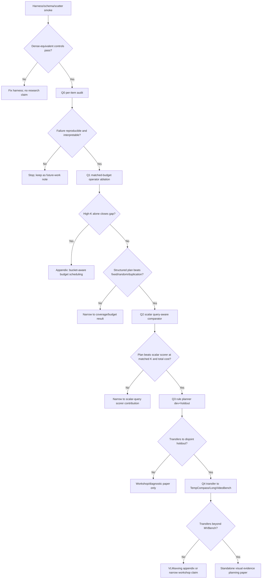

# Query-Aware Visual Routing: Research Seed

Status: self-standing handoff note for a future paper/branch. Do not implement
on the current RLT/VLMaxxing closure branch.

Audience: an expert scientist who has not read this repo. The goal is to give
enough context to run an extensive literature and experiment-design pass, then
bring back a concrete query-aware visual-routing proposal.

Evidence labels:

- `reproduced here`: measured in this repo with checked scripts/artifacts.
- `imported result`: from cited literature, not reproduced in this repo.
- `hypothesis`: proposed next work.

2026-05-10 deep-research update: ChatGPT's external literature assessment
largely validates the direction but narrows the novelty boundary. The surface
form "query-aware video token/frame selection" is crowded. A standalone paper
is justified only if we show **structured visual evidence planning**: a
training-free planner that chooses among heterogeneous physical evidence
operators under measured end-to-end cost, and beats fixed/random coverage plus
strong scalar query-aware scorers. If the win collapses to "use more K" or "use
one scalar query score," this belongs as a VLMaxxing appendix or ablation, not
as a separate paper.

## One-Sentence Thesis

Video VLM acceleration should be planned from the question. Motion-only routing
is an excellent cheap default, but the query decides whether the model needs
motion evidence, static appearance detail, endpoint frames, object relations,
or a repair pass. This is visual query planning.

## Why This Exists

VLMaxxing is this repo's training-free anti-recomputation project for video
VLMs. The current paper centers on three axes:

- **C-CEILING**: arithmetic ceiling discipline. End-to-end speedup survives
  only in proportion to the dense runtime share a method actually reduces.
- **C-VISION**: first-pass vision-tower compute reduction. The vision tower
  processes only selected visual positions, then scatter-back preserves prompt
  geometry for the language model.
- **C-PERSIST**: after-ingest same-video follow-up reuse. The expensive prefix
  is paid once; later questions reuse state.

The query-aware idea comes from a sharp C-VISION/RLT result. We used RLT
motion scores as the C-VISION scorer on Gemma 4 E4B / MLX-VLM. RLT is cheap:
it scores raw frames before the model runs. The competing max-min diversity
scorer is much more expensive because it works over encoder hidden states.

Local preliminary facts, all reproduced here:

- RLT-as-C-VISION at `keep_rate=0.5` lands positive n=30 E2E cells on
  VideoMME, TOMATO, and MVBench.
- RLT's scorer cost is tens of milliseconds per item; max-min diversity costs
  seconds per item. RLT reaches the same speed class as max-min at roughly two
  orders of magnitude lower scorer cost.
- Direct RLT full composition is high-upside but bucket-conditional. The
  dev+holdout pooled speed frontier is strong, including an MVBench
  direct-composition row at `1.842x` E2E, but quality is not uniformly clean.
- Bucket-specific rescue by raising keep-rate to `0.85` recovers MVBench
  `object_interaction`, but pooled rescue still has bucket failures:
  VideoMME `long`/`medium`, TOMATO `direction`/`rotation`, and MVBench
  `action_localization`/`moving_attribute`.
- `moving_attribute` is the sharpest example, not a universal law. On the dev
  slice, `moving_attribute` stayed at dense accuracy `0.833`, composed accuracy
  `0.333`, and `Delta acc = -0.50` even when its keep-rate was raised to `1.0`.
  On the disjoint holdout slice, however, `moving_attribute` was clean at the
  base `keep_rate=0.5`. The failure is item/content-class variance, not proof
  that the whole bucket is deterministically unrecoverable.

That last point is the discovery. Motion-only routing is excellent when motion
is the evidence, but the query can ask for something else: static appearance,
endpoint state, object identity, object relations, or a localized action cue.
Raising K inside the same motion policy sometimes recovers a class and
sometimes does not. The next method should not be "keep more motion tokens."
It should be "plan the visual evidence from the query."

Round-20 also means some obvious falsification work is already done. We have
already run disjoint holdout replication and a dev-slice `moving_attribute`
`keep_rate=1.0` bracket. The next branch should not repeat those cells as if
they were unknown. It should use them as boundary evidence and move directly to
matched-budget operator ablations: static-detail floors, endpoint anchors,
fixed coverage, random coverage, duplication-aware coverage, and one scalar
query-aware comparator.

Relevant local source files:

- Current paper framing: `paper/framing.md`
- RLT follow-up prereg/results ledger:
  `research/experiments/2026/2026-05-08-rlt-followup-next-prereg.md`
- Decision ledger:
  `research/decision-log.md`
- Follow-up queue:
  `scripts/run_rlt_followup_queue.py`
- Full-composition analyzer:
  `scripts/analyze_gemma_full_composition.py`

## Definitions

### VLMaxxing / C-VISION

`VLMaxxing` is the repo's name for a family of training-free video-VLM
efficiency techniques. The part relevant here is `C-VISION`: reduce vision
tower work by selecting a subset of valid encoder positions per frame, then
scatter-back the skipped positions so the language-model prompt geometry is
unchanged.

The core C-VISION principle:

```text
E2E speedup is bounded by the share of runtime owned by vision compute and by
how much of that vision compute is actually removed.
```

This is not just a token-count story. It is a measured-work story. If decode or
generation dominates, even a large visual reduction yields only a small E2E
gain. If vision dominates, the same visual reduction becomes a large user-facing
speedup.

### RLT

RLT, "Don't Look Twice: Faster Video Transformers with Run-Length
Tokenization" (NeurIPS 2024), identifies repeated same-location patches across
time before model inference. It is cheap because it operates on raw patches,
not encoder hidden states. Imported RLT result: the paper reports faster video
transformer training/inference by removing repeated token runs while preserving
accuracy on action-recognition/video tasks.

Our use of RLT is not a reproduction of RLT's original VideoMAE/action
recognition setup. It is a transfer test: use RLT's raw-frame motion prior as
the scorer inside C-VISION and, separately, as a prompt-admission policy for a
video VLM.

### Query-Aware Visual Routing

Query-aware visual routing is a proposed next method family. It treats the
question as a query plan input:

- dynamic-action question: prioritize motion/delta/RLT evidence.
- static-attribute question: preserve keyframe or endpoint appearance detail.
- object-interaction question: preserve object-pair coverage plus motion.
- temporal-order question: preserve begin/middle/end temporal anchors.
- low-confidence or high-risk question: trigger a repair pass with more static
  detail or higher resolution.

The output is a visual evidence plan: frame selection, resolution selection,
token budget, static-detail floor, motion budget, and optional repair policy.

## Database Query Planning Analogy

The analogy is useful and dangerous.

Useful: SQL is declarative. The user specifies what they want; the database
optimizer chooses access paths, join orders, and physical operators based on
predicates and costs. A video question is also declarative. The user asks for a
fact; the VLM runtime chooses what visual evidence to retrieve and compute.

Dangerous: database query plans preserve exact semantics. Visual routing only
preserves answer fidelity statistically. Therefore every query-aware routing
method needs paired accuracy, parse-failure, and E2E gates. A plan that is fast
but silently changes answers is not a valid plan.

Mapping:

| Database optimizer | Query-aware visual routing |
|---|---|
| predicate | question phrase / task type |
| table statistics | frame/token redundancy statistics |
| index scan | cheap motion/RLT pass |
| join order | order of visual evidence acquisition |
| System R-style static plan | choose the initial evidence mix from query class and cost |
| Eddies-style adaptive routing | repair pass or re-ordering after low confidence |
| cost model | E2E latency model with vision/decode/generate shares |
| exact answer | paired VLM fidelity target |

This suggests a paper frame: **visual evidence planning for VLMs**. The runtime
should choose a plan, not a fixed pruning rule.

The better database analogy is not "VLM routing is exact query optimization."
It is closer to approximate query processing: the runtime trades latency for a
bounded answer-fidelity risk and must report error/fidelity bars. System R is
useful for costed access-path selection, Eddies is useful for adaptive
re-routing, and BlinkDB is useful because it makes latency/error trade-offs
explicit. The paper should use all three analogies carefully and never imply
database-style correctness guarantees.

## Deep-Research Assessment: Verdict And Novelty Boundary

The external assessment is **VALID** on the main point: query-aware selection is
not novel by itself. Related work already includes query-adaptive static/dynamic
allocation, learned query-conditioned frame selection, training-free
query-aware frame selection, learned query-aware token selection with adaptive
budgets, training-free text-guided token pruning, and critiques showing that
importance scores can lose to random/fixed baselines.

What remains plausibly new:

1. **Operator-level plans, not scalar scores.** The planner chooses physical
   evidence operators such as motion scan, static-detail floor, endpoint
   anchors, resolution changes, and repair. It does not merely rank tokens by
   one query-conditioned scalar.
2. **Training-free, pre-vision default.** RLT remains the cheap first-stage
   evidence scan. More expensive query-aware operators are paid only when the
   query or risk signal justifies them.
3. **Total-cost accounting.** The unit is dense-paired fidelity versus measured
   decode + scorer + vision + prefill + generate + repair cost. Token count
   and mask quality are not sufficient.
4. **Fixed/random/duplication controls.** The planner must beat simple coverage
   and duplication-aware baselines at matched valid-position K. This is
   mandatory because the pruning-critique literature shows that naive baselines
   can embarrass importance scores.

What we must not claim:

- first query-aware frame or token selection method;
- exact database-style query optimization;
- universal recovery of `moving_attribute` or any single bucket;
- a standalone paper if fixed/random coverage or higher K explains the effect;
- speedup without end-to-end scorer and repair costs.

## Core Hypotheses

### H1: Query type predicts the right visual evidence mix

Some `moving_attribute` and adjacent static/detail-sensitive items fail because
the query asks for appearance, endpoint state, object identity, object
relations, or localized action cues that a motion-first score can under-cover.
A query-aware planner that adds endpoint/static-detail evidence should recover
those items at a lower cost than globally raising keep-rate.

Falsification: fixed static coverage, random valid-token selection, or a
duplication-aware control matches the query-aware planner on the same failed
items at the same valid-position budget.

### H2: Motion-first, query-repair is cheaper than query-aware everywhere

RLT is so cheap that it should remain the first-stage default. The planner
should only pay for text-guided or high-resolution detail when the query is
likely to need it.

Falsification: always-on query-aware scoring is needed to recover quality, or
the repair gate fires so often that it becomes dense-by-another-name.

### H3: Static-detail floors repair a different failure class than higher K

Raising RLT K keeps more of the same motion-ranked evidence. A static-detail
floor reserves evidence that motion ranking may never surface.

Falsification: raising RLT K and adding a static-detail floor produce the same
per-item repairs and the same errors.

### H4A: Structured evidence plans beat scalar token scores

A single scalar token score cannot express "keep endpoint frame at higher
resolution, keep object-pair coverage, and keep motion deltas elsewhere."
Query-aware routing should choose a structured plan.

Falsification: a strong scalar query-aware scorer, such as FlashVLM-style
text-guided token scoring, matches or beats structured plans on paired fidelity
under the same valid-position budget, including fixed and random coverage
controls.

### H4B: Planner benefit survives total-cost accounting

An evidence plan is only useful if the quality it recovers is worth the scorer,
planner, repair, and re-prefill costs it adds. The unit of comparison is the
full measured runtime, not just mask quality.

Falsification: the structured planner recovers quality but loses E2E to a
simpler policy such as higher fixed RLT K, fixed static coverage, or dense
fallback after all costs are counted.

## Candidate Experiments

All experiments should use the same rigor as the current RLT/VLMaxxing branch:
paired dense/sparse rows, valid-position budgeting, hard shape failures,
bootstrap confidence intervals, parse-failure deltas, and disjoint holdout
manifests.

### Updated Experimental Tree (2026-05-10)

#### Q0: Evidence audit and failure taxonomy

Use the existing round-20 artifacts before writing new routing code. Build a
per-item table for direct and rescue composition: dense answer, composed
answer, correctness, parse status, bucket, group keep-rate, prompt-admission
K, C-VISION K, and whether the item was fixed by rescue, harmed by rescue, or
unchanged.

Accept if the failure set clusters around interpretable evidence needs:
appearance-under-motion, endpoint state, object relation, temporal order, or
localized action. Falsify if failures are dominated by parse drift,
non-determinism, or evaluator ambiguity.

Resource estimate: analyzer-only, minutes on this machine.

#### Q1: Matched-budget operator ablation

Target MVBench `moving_attribute` and `object_interaction` first, with TOMATO
`direction`/`rotation` and VideoMME `long`/`medium` as regression probes. Run
matched valid-position K across:

- RLT motion score;
- higher-K RLT where not already measured;
- fixed uniform coverage;
- deterministic random valid-position coverage, multi-seed;
- duplication-aware coverage, DART-style where feasible;
- RLT plus endpoint anchors;
- RLT plus a low-rate static-detail floor;
- RLT plus endpoint anchors plus static-detail floor.

Accept if a structured operator plan recovers more paired failures than the
best fixed/random/duplication baseline while keeping at least 70-80% of the
base RLT C-VISION E2E gain. Reject the standalone-paper path if fixed/random or
plain higher-K RLT matches the plan.

Resource estimate: 1-3 hours for n=30 targeted local cells after code exists;
longer if deterministic random/duplication controls need new runner support.

#### Q2: Scalar query-aware comparator

Implement or approximate one strong scalar query-aware baseline. Preferred
order:

1. FlashVLM-style text-guided visual-token score if it can be implemented
   locally without training and without adding a heavy dependency.
2. CLIP/Q-Frame-style query-frame similarity plus valid-position allocation.
3. SparseVLM/PruneVid-style text-guided token relevance if local hooks can be
   made faithful.

Accept structured planning only if it beats the scalar baseline on the target
failure classes at matched K and total cost. If the scalar baseline matches the
planner, the contribution should narrow to "cheap scalar query scorer inside
C-VISION," not visual query planning.

Resource estimate: highly implementation-dependent; smoke first on n=1 before
any benchmark cells.

#### Q3: Rule-based visual evidence planner

After Q1/Q2 identify useful operators, add a cheap query classifier:

- motion/action queries -> RLT motion-first;
- appearance/material/color/state queries -> RLT + static-detail floor;
- begin/end/first/last queries -> endpoint anchors + RLT;
- object interaction/relation queries -> static-detail floor + motion, with
  object-pair coverage only if a cheap proxy exists;
- high-risk or low-confidence outputs -> repair pass.

Accept if the rule planner improves the speed/fidelity frontier over a single
global policy on disjoint holdout. Reject if the rules overfit the dev buckets
or trigger so often that the method becomes dense-by-another-name.

Resource estimate: local n=30 dev + n=30 holdout per benchmark, gated by Q1/Q2.

#### Q4: Transfer and benchmark breadth

Only after Q3 lands locally, transfer to at least one benchmark that was not
used to design the rules:

- TempCompass for temporal aspect isolation, especially direction, order, and
  attribute-change;
- LongVideoBench for long-context referred reasoning;
- VideoMME and TOMATO as broad regression checks.

Accept a standalone paper only if the planner transfers beyond one MVBench
diagnostic bucket. If it does not transfer, keep the result as a focused
VLMaxxing appendix or workshop paper.

Resource estimate: dataset ingestion may dominate; start with manifest smoke
and n=10 pilot before any full run.

#### Q5: Repair and approximate-query framing

Add repair only after a first-pass planner has a measurable but incomplete
frontier. Report repair-fire rate, extra prefill/vision cost, recovered
failure count, and false-repair count.

Accept if repair fires on less than 40% of target items and improves paired
fidelity enough that total E2E remains above the simpler fixed-K policy.
Reject if repair is effectively dense fallback.

#### Cancellation tree



### Legacy Candidate Cells From The First Seed

The first seed listed Q1-Q6 below. Keep them as implementation sketches, but
the updated tree above is authoritative. In particular, do not run these before
the harness gate, per-item failure audit, fixed/random/duplication controls,
and scalar-query comparator are in place.

### Legacy Q1: Static/Delta Explore-Then-Select

Run a small grid of static-keyframe budget versus delta/RLT budget. Select the
allocation from query type.

Accept if `moving_attribute` improves over fixed RLT `keep_rate=0.5` and
`0.85` at equal or lower average token budget.

Falsify if the selected allocation does not beat the best fixed allocation on
holdout.

### Legacy Q2: Endpoint Detail Floor

For questions containing words such as `begin`, `end`, `first`, `last`,
`color`, `shape`, `material`, `state`, `stationary`, or `moving object`, keep
endpoint frames and a small uniform static-detail floor, then apply RLT
elsewhere.

Accept if `moving_attribute` improves with less added budget than the
group-level `0.85` rescue.

Falsify if gains require nearly dense visual budget.

### Legacy Q3: RLT + Static Coverage Floor

Union RLT top-K motion positions with a low-rate static coverage floor sampled
over low-motion regions.

Accept if this repairs attribute and interaction flips with less than 10-15%
added visual tokens.

Falsify if it mostly helps unrelated groups or erases C-VISION E2E gains.

### Legacy Q4: Query-Aware Scorer Head-To-Head

Compare these under the same valid-position K:

- RLT score
- text-guided relevance score
- CLIP query-frame similarity
- fixed uniform coverage
- random valid-token selection
- static-detail floor plus RLT

Accept if query-aware scoring specifically improves `moving_attribute` and
`object_interaction`.

Falsify if random or fixed coverage matches it. The token-pruning literature
warns this is a real possibility.

### Legacy Q5: Adaptive Repair Gate

Run cheap RLT first. Trigger static-detail re-prefill only when query class plus
answer uncertainty predicts attribute risk.

Accept if repair fires on less than 40% of MVBench items and recovers most
RLT-induced `moving_attribute` drift.

Falsify if the guard has weak predictive value or repair fires so often that
the method is effectively dense.

### Legacy Q6: Visual Query Planner Cost Model

Build a simple optimizer that predicts E2E from:

- decode cost
- vision share
- vision reduction
- scorer cost
- prompt/prefill chunking regime
- expected repair probability

Accept if the cost model predicts chosen-plan E2E within 5-10% across held-out
plans.

Falsify if query-conditioned generation length or substrate effects dominate
the cost model without a usable correction.

This is secondary scope. A cost model makes the paper stronger, but the first
paper can stand on Q1-Q5 if the measured policy beats fixed/random coverage and
simple scalar scorers under total-cost accounting.

## What Would Make This A Separate Paper

The standalone paper is not "RLT, but query-aware." It is:

> Video VLM inference should be planned like a query: the question determines
> which visual evidence is worth computing.

Potential claims:

1. Motion-only routing is a strong default but fails predictably on static
   attribute questions.
2. A lightweight query planner can choose among motion, static, endpoint, and
   repair evidence plans.
3. Structured evidence plans beat scalar token scores on the failure classes
   where scalar scores lack the right inductive bias.
4. Query-aware routing should report dense-paired fidelity, not only token
   reduction, because visual pruning is approximate query processing rather
   than exact query optimization.

The first target is modest: recover MVBench `moving_attribute` without giving
up the RLT/C-VISION speed story. The larger target is a general visual query
planner for frozen VLM runtimes.

## Guardrails

- Do not tune on one dev slice and call it solved. Use disjoint holdout
  manifests early.
- Include random and fixed-coverage baselines. Query-aware methods must beat
  simple coverage under the same valid-position K.
- Separate scorer cost from vision cost. A query-aware scorer that costs
  seconds per item may lose even if its mask is better.
- Keep C-VISION and prompt admission separate until direct composition is
  measured.
- Do not claim database-style exactness. This is approximate visual evidence
  planning with measured answer-fidelity gates.
- Track per-bucket results. Aggregate accuracy can hide the exact class the
  planner is supposed to repair.

## Literature Starting Points

### This repo / VLMaxxing

- `paper/framing.md`: current paper story and contribution boundaries.
- `paper/claim-matrix.md`: current claim status.
- `research/experiments/2026/2026-05-08-rlt-followup-next-prereg.md`:
  RLT/VLMaxxing queue, hypotheses, and Round-19 interpretation.
- `research/decision-log.md`: adopted/weakened/killed ideas.

Interpretation: VLMaxxing supplies the systems frame and the measured failure
that motivates query-aware planning. It is unpublished local work; label all
of its numbers `reproduced here`, not imported literature.

### RLT

- [Don't Look Twice: Faster Video Transformers with Run-Length Tokenization,
  NeurIPS 2024](https://proceedings.neurips.cc/paper_files/paper/2024/hash/3181db351fd3ced43cd589b0b572675d-Abstract-Conference.html)
- [Hugging Face paper page](https://huggingface.co/papers/2411.05222)

Use: cheap pre-model motion/redundancy prior. Boundary: not query-aware and
not designed to preserve static appearance details when motion saliency is low.

### Query-aware video/token selection

- [Static or Dynamic: Towards Query-Adaptive Token Selection for Video Question
  Answering, EMNLP 2025](https://aclanthology.org/2025.emnlp-main.545/)

Most directly relevant. It explicitly separates static keyframe detail from
dynamic delta evidence and chooses allocation from the query.

- [Q-Frame: Query-aware Frame Selection and Multi-Resolution Adaptation for
  Video-LLMs, ICCV 2025](https://openaccess.thecvf.com/content/ICCV2025/html/Zhang_Q-Frame_Query-aware_Frame_Selection_and_Multi-Resolution_Adaptation_for_Video-LLMs_ICCV_2025_paper.html)

Relevant for endpoint/high-resolution detail: question relevance can choose
which frames deserve more pixels.

- [Seeing the Forest and the Trees: Query-Aware Tokenizer for Long-Video
  Multimodal Language Models / QTSplus](https://arxiv.org/abs/2511.11910)

Relevant for query-conditioned token budgets and temporal-order preservation.

- [PruneVid: Visual Token Pruning for Efficient Video Large Language Models,
  ACL Findings 2025](https://aclanthology.org/2025.findings-acl.1024/)

Relevant because it combines temporal/static redundancy reduction with
query-relevant pruning.

- [SparseVLM: Visual Token Sparsification for Efficient Vision-Language Model
  Inference, ICML 2025](https://arxiv.org/abs/2410.04417)

Useful text-guided training-free baseline, especially for in-LLM scoring.

- [An Image is Worth 1/2 Tokens After Layer 2 / FastV, ECCV
  2024](https://arxiv.org/abs/2403.06764)

Generic plug-and-play visual token pruning baseline. It is likely not enough
for pre-vision evidence planning, but it is a necessary comparator.

- [LongVU: Spatiotemporal Adaptive Compression for Long Video-Language
  Understanding](https://arxiv.org/abs/2410.17434)

Relevant because it uses cross-modal query information plus inter-frame
dependencies for adaptive compression. Boundary: different compression stage
and not the same operator-level planning claim, but a close query-aware
compression prior.

- [Token Pruning in Multimodal Large Language Models: Are We Solving the Right
  Problem?, ACL Findings 2025](https://aclanthology.org/2025.findings-acl.802/)

Guardrail paper. Treat its critique as mandatory: compare against random and
fixed coverage, and be skeptical of attention/language-guided scores unless
they beat simple baselines under matched evaluation.

- [Stop Looking for "Important Tokens" in Multimodal Language Models:
  Duplication Matters More / DART, EMNLP 2025](https://aclanthology.org/2025.emnlp-main.505/)

Guardrail and baseline source. It argues duplication can matter more than
importance and reports strong training-free pruning. Use a duplication-aware
control when feasible.

- [Frame-Voyager: Learning to Query Frames for Video Large Language Models,
  ICLR 2025 / arXiv 2410.03226](https://arxiv.org/abs/2410.03226)

Use: venue-backed evidence that frame selection should be conditioned on the
textual query and can be learned from Video-LLM loss rankings. Boundary:
trained frame-combination selection, not training-free token routing or a
pre-vision C-VISION scorer. This is the closest prior to the "evidence plan"
idea; the proposed paper must explain why costed, training-free token/frame
planning is different from a learned frame-combination policy.

- [M-LLM Based Video Frame Selection for Efficient Video Understanding, CVPR
  2025 / arXiv 2502.19680](https://arxiv.org/abs/2502.19680)

Use: trained query-adaptive frame selector with spatial and temporal
pseudo-labeling. Boundary: frame-level selection with extra model/scorer cost,
not structured token-budget planning inside C-VISION.

- [FlashVLM: Text-Guided Visual Token Selection for Large Multimodal Models,
  arXiv 2512.20561](https://arxiv.org/abs/2512.20561)

Use: text-guided scalar visual-token scoring baseline. Boundary:
under-submission preprint; cite as preprint only. It is a key H4A comparator
because a strong scalar token scorer could falsify the need for structured
evidence plans.

### Database query planning analogy

- [Access Path Selection in a Relational Database Management System, SIGMOD
  1979 / System R](https://research.ibm.com/publications/access-path-selection-in-a-relational-database-management-system)
- [Eddies: Continuously Adaptive Query Processing, SIGMOD Record
  2000](https://sigmodrecord.org/2000/06/08/eddies-continuously-adaptive-query-processing/)
- [BlinkDB: Queries with Bounded Errors and Bounded Response Times on Very
  Large Data, EuroSys 2013](https://amplab.cs.berkeley.edu/publication/blinkdb-queries-with-bounded-errors-and-bounded-response-times-on-very-large-data/)
- [QO-Advisor: Query Optimization Advisor for Cloud Databases](https://arxiv.org/abs/2210.13625)

Use these for framing, not for overclaiming. The analogy is "choose access
paths from predicates and costs"; the key difference is that visual plans are
approximate and must be empirically gated.

## Handoff Questions For The Next Scientist

1. What is the cleanest taxonomy of video questions for visual evidence
   planning: motion, static attribute, object relation, temporal order,
   counting, scene context, or something else?
2. Which query-aware prior is cheapest enough to run before the vision tower:
   lexical rules, CLIP frame matching, lightweight text-image scoring, or a
   small frozen classifier?
3. Can a static-detail floor repair `moving_attribute` without dense fallback?
4. Are there public benchmarks with enough attribute/object-binding questions
   to test this beyond MVBench?
5. Which baselines are mandatory to avoid the "random pruning is competitive"
   critique?
6. Can the planner be expressed as a costed policy tree, like a database query
   plan, with a measured E2E model?
7. What minimal result would justify a standalone paper instead of a
   VLMaxxing appendix?

## Near-Term Recommendation

The current RLT/VLMaxxing branch has already run disjoint holdout replication.
Before forking implementation, finish any desired M5 scorer-transfer scale
check. Then fork a query-aware branch with a narrow first target:

```text
Recover static/detail-sensitive failures under pooled composition by adding
query-conditioned static detail to RLT C-VISION, while preserving most of the
RLT speedup and beating fixed/random coverage controls. Use MVBench
moving_attribute as the first stress test, not as the only target.
```

If that lands, the research direction is strong enough for its own paper.
